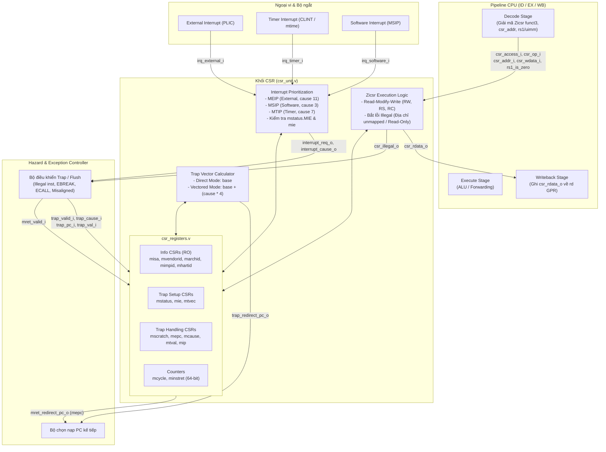

# Khối Control and Status Registers (CSR) & Chuẩn Zicsr theo RISC-V Privileged v1.12

Thư mục này chứa khối **Control and Status Registers (CSR Unit)** được thiết kế tuân thủ theo chuẩn **RISC-V Privileged Specification v1.12 (Machine-mode)** và tập lệnh mở rộng **Zicsr (Control and Status Register Instructions)**, phục vụ tích hợp trực tiếp vào core CPU RISC-V 32-bit (RV32I).

Toàn bộ RTL tổng hợp được viết bằng **Verilog-2001** theo phong cách ASIC chuẩn công nghiệp, không sử dụng `initial` trong RTL tổng hợp, không có vòng lặp unroll phức tạp, không phụ thuộc thuộc tính FPGA (`ram_style`, `use_dsp`). Module wrapper `CSR_if.sv` dùng SystemVerilog đồng bộ với phong cách interface của toàn repository.

---

## 1. Cấu trúc thư mục

```text
00_src/CSR/
├── README.md                # Tài liệu kỹ thuật chi tiết
├── CSR_if.sv                # Wrapper SystemVerilog theo chuẩn module core (*_if.sv)
├── rtl/
│   ├── csr_defines.v        # Định nghĩa địa chỉ CSR, mã lệnh Zicsr, mã Exception & Interrupt
│   ├── csr_registers.v      # Bộ lưu trữ thanh ghi CSR vật lý, trường WARL và đọc/ghi
│   └── csr_unit.v           # Top-level CSR Unit: giải mã Zicsr, ưu tiên ngắt, phân nhánh bẫy
└── tb/
    └── csr_tb.v             # Testbench tự kiểm tra (self-checking) toàn diện với 27 ca kiểm thử
```

| File | Module chính | Chức năng |
| :--- | :--- | :--- |
| `csr_defines.v` | *(Header / Macro)* | Định nghĩa các địa chỉ CSR chuẩn (`0x300..0xF14`), mã thao tác Zicsr `funct3`, mã bẫy ngoại lệ và ngắt |
| `csr_registers.v` | `csr_registers` | Lưu trữ vật lý các thanh ghi Machine mode (`mstatus`, `misa`, `mie`, `mtvec`, `mscratch`, `mepc`, `mcause`, `mtval`, `mip`, `mcycle`, `minstret`), ghép kênh đọc tổ hợp, cập nhật tuần tự theo thứ tự ưu tiên (Trap > MRET > CSR Write) |
| `csr_unit.v` | `csr_unit` | Top module khối CSR: phân giải lệnh nguyên tử Zicsr (Read-Modify-Write), phát hiện lệnh CSR bất hợp pháp, ưu tiên phần cứng ngắt (`MEIP > MSIP > MTIP`), tính toán vector nhảy bẫy (Direct / Vectored) |
| `CSR_if.sv` | `CSR_if` | Wrapper SystemVerilog bọc `csr_unit` đồng bộ với format `CORE_if.sv`, `DMI_if.sv`, `TAGE_if.sv` |
| `csr_tb.v` | `csr_tb` | Testbench tự kiểm chứng 27 kịch bản: giá trị reset, các lệnh CSRRW/RS/RC và dạng tức thời, bắt CSR bất hợp pháp, trap ngoại lệ, ngắt ưu tiên vectored, lệnh MRET, và bộ đếm hiệu năng |

---

## 2. Kiến trúc khối CSR Unit



---

## 3. Bảng thanh ghi CSR (CSR Register Map)

Hỗ trợ các thanh ghi Machine-Mode theo chuẩn RISC-V Privileged v1.12:

| Địa chỉ CSR | Tên thanh ghi | Quyền | Giá trị Reset | Mô tả chi tiết |
| :---: | :--- | :---: | :---: | :--- |
| `0x300` | `mstatus` | R/W | `0x00001800` | Trạng thái CPU: `MIE` (bit 3 - cho phép ngắt M-mode), `MPIE` (bit 7 - MIE trước khi trap), `MPP` (bits 12:11 - cố định `2'b11` cho M-mode) |
| `0x301` | `misa` | RO / WARL | `0x40000100` | Khả năng tập lệnh CPU: MXL=1 (32-bit, bits 31:30 = `01`), cờ `I` (bit 8 = `1` cho RV32I). Ghi vào misa không thay đổi giá trị |
| `0x304` | `mie` | R/W | `0x00000000` | Cho phép từng ngắt riêng rẽ: `MSIE` (bit 3 - software), `MTIE` (bit 7 - timer), `MEIE` (bit 11 - external) |
| `0x305` | `mtvec` | R/W | `0x00000000` | Vector bẫy Machine: bits `[31:2]` là `BASE` (căn lề 4-byte), bits `[1:0]` là `MODE` (`00`: Direct, `01`: Vectored) |
| `0x340` | `mscratch` | R/W | `0x00000000` | Thanh ghi cào dành cho hệ điều hành / trình xử lý bẫy trap handler |
| `0x341` | `mepc` | R/W | `0x00000000` | Machine Exception Program Counter: lưu địa chỉ lệnh gặp ngoại lệ hoặc bị ngắt |
| `0x342` | `mcause` | R/W | `0x00000000` | Nguyên nhân bẫy: bit 31 là cờ `Interrupt` (`1` = ngắt, `0` = exception), bits `[4:0]` là mã nguyên nhân `Exception Code` |
| `0x343` | `mtval` | R/W | `0x00000000` | Machine Bad Address/Value: lưu địa chỉ gây lỗi truy cập bộ nhớ hoặc mã opcode lệnh lỗi |
| `0x344` | `mip` | RO | `0x00000000` | Cờ ngắt đang chờ xử lý (nối trực tiếp từ ngõ vào chân phần cứng): `MSIP` (bit 3), `MTIP` (bit 7), `MEIP` (bit 11) |
| `0xB00` / `0xC00` | `mcycle` / `cycle` | R/W / RO | `0x00000000` | 32-bit thấp của bộ đếm chu kỳ xung nhịp chạy CPU |
| `0xB80` / `0xC80` | `mcycleh` / `cycleh` | R/W / RO | `0x00000000` | 32-bit cao của bộ đếm chu kỳ |
| `0xB02` / `0xC02` | `minstret` / `instret` | R/W / RO | `0x00000000` | 32-bit thấp của bộ đếm số lệnh đã hoàn thành thực thi (retire) |
| `0xB82` / `0xC82` | `minstreth` / `instreth`| R/W / RO | `0x00000000` | 32-bit cao của bộ đếm số lệnh đã hoàn thành |
| `0xF11` | `mvendorid` | RO | `0x00000000` | ID nhà sản xuất (JEDEC, `0` = non-commercial) |
| `0xF12` | `marchid` | RO | `0x00000000` | Mã kiến trúc mã nguồn mở (0) |
| `0xF13` | `mimpid` | RO | `0x00010000` | Phiên bản hiện thực hoá vi kiến trúc (v1.0) |
| `0xF14` | `mhartid` | RO | `HART_ID` (0) | ID định danh của lõi xử lý (cấu hình qua parameter) |

---

## 4. Tập lệnh Zicsr và cơ chế thao tác nguyên tử

Module hỗ trợ đầy đủ 6 lệnh chuẩn Zicsr (opcode `7'b1110011` - SYSTEM):

```text
 31                     20 19         15 14   12 11          7 6            0
+-------------------------+-------------+-------+-------------+--------------+
|        csr [11:0]       |  rs1 / uimm | funct3|     rd      |    SYSTEM    |
+-------------------------+-------------+-------+-------------+--------------+
```

| Lệnh | `funct3` | Nguồn dữ liệu | Hành vi đọc (`rd`) | Hành vi ghi (`csr`) | Ghi chú |
| :--- | :---: | :---: | :--- | :--- | :--- |
| **`CSRRW`** | `001` | Thanh ghi `rs1` | Đọc giá trị cũ vào `rd` | Ghi đè: `csr <= rs1` | Ghi vô điều kiện |
| **`CSRRS`** | `010` | Thanh ghi `rs1` | Đọc giá trị cũ vào `rd` | Bật bit: `csr <= csr \| rs1` | Không ghi nếu `rs1 == x0` |
| **`CSRRC`** | `011` | Thanh ghi `rs1` | Đọc giá trị cũ vào `rd` | Xoá bit: `csr <= csr & ~rs1` | Không ghi nếu `rs1 == x0` |
| **`CSRRWI`** | `101` | Hằng số tức thời `uimm[4:0]` | Đọc giá trị cũ vào `rd` | Ghi đè: `csr <= zero_ext(uimm)` | Ghi vô điều kiện |
| **`CSRRSI`** | `110` | Hằng số tức thời `uimm[4:0]` | Đọc giá trị cũ vào `rd` | Bật bit: `csr <= csr \| uimm` | Không ghi nếu `uimm == 0` |
| **`CSRRCI`** | `111` | Hằng số tức thời `uimm[4:0]` | Đọc giá trị cũ vào `rd` | Xoá bit: `csr <= csr & ~uimm` | Không ghi nếu `uimm == 0` |

### Quy tắc an toàn & Ngoại lệ Illegal Instruction (`csr_illegal_o`):
Theo chuẩn RISC-V Privileged:
1. **CSR chỉ đọc (Read-Only)**: Các thanh ghi có địa chỉ với bits `[11:10] == 2'b11` (như `mvendorid` `0xF11`, `marchid` `0xF12`, `mcycle` tầng U `0xC00`) khi có lệnh cố tình ghi sẽ kích hoạt cờ `csr_illegal_o = 1`. Lệnh đọc thuần túy (như `CSRRS` với `rs1 = x0`) được phép thực thi bình thường.
2. **CSR chưa định nghĩa (Unmapped Address)**: Mọi thao tác truy cập đến địa chỉ CSR không nằm trong danh sách hỗ trợ đều kích hoạt cờ `csr_illegal_o = 1`.

---

## 5. Cơ chế xử lý bẫy Trap & Ngắt (Interrupt & Exception)

### 5.1. Thứ tự ưu tiên ngắt phần cứng
Khi cờ toàn cục `mstatus.MIE = 1`, các ngắt được phân xử theo độ ưu tiên giảm dần chuẩn RISC-V:
1. **External Interrupt** (`MEIP`, mã `11`): Độ ưu tiên cao nhất (từ bộ điều khiển ngắt ngoài PLIC).
2. **Software Interrupt** (`MSIP`, mã `3`): Độ ưu tiên thứ nhì (ngắt liên nhân / IPI).
3. **Timer Interrupt** (`MTIP`, mã `7`): Độ ưu tiên thứ ba (ngắt định thời CLINT).

### 5.2. Tính toán địa chỉ chuyển nhánh bẫy (`trap_redirect_pc_o`)
Tuỳ thuộc vào trường `mtvec.MODE` (`mtvec[1:0]`):
- **Direct Mode (`mtvec[1:0] == 2'b00`)**:
  Mọi bẫy (ngoại lệ và ngắt) đều chuyển hướng đến địa chỉ:
  $$\text{PC\_redirect} = \{\text{mtvec}[31:2], 2'b00\}$$
- **Vectored Mode (`mtvec[1:0] == 2'b01`)**:
  - Ngoại lệ đồng bộ (Exceptions): Vẫn nhảy về địa chỉ cơ sở $\text{BASE}$.
  - Ngắt bất đồng bộ (Interrupts): Nhảy theo bảng vector:
  $$\text{PC\_redirect} = \{\text{mtvec}[31:2], 2'b00\} + (\text{cause} \times 4)$$

### 5.3. Trình tự khi vào bẫy (Trap Entry)
Khi có xung `trap_valid_i`:
1. `mstatus.MPIE <= mstatus.MIE` (lưu lại trạng thái cho phép ngắt).
2. `mstatus.MIE <= 1'b0` (tắt ngắt toàn cục để tránh ngắt lồng nhau ngoài ý muốn).
3. `mstatus.MPP <= 2'b11` (chốt mode đặc quyền trước đó là Machine mode).
4. `mepc <= trap_pc_i` (lưu địa chỉ lệnh bị ngắt hoặc gây lỗi).
5. `mcause <= {trap_is_interrupt_i, 26'b0, trap_cause_i}`.
6. `mtval <= trap_val_i` (lưu thông tin bổ trợ địa chỉ lỗi / opcode lỗi).

### 5.4. Trình tự khi thoát bẫy bằng lệnh `MRET` (Trap Return)
Khi core thực thi lệnh `MRET` (phát xung `mret_valid_i`):
1. `mstatus.MIE <= mstatus.MPIE` (khôi phục trạng thái ngắt trước khi trap).
2. `mstatus.MPIE <= 1'b1` (chuẩn hoá MPIE về 1).
3. `mret_redirect_pc_o = mepc` (bộ đếm chương trình nhảy về lệnh được lưu trong `mepc`).

---

## 6. Danh sách cổng giao tiếp (Interface Ports)

### 6.1. Giao diện thực thi Zicsr (Nối với tầng Decode / Execute)
- `csr_access_i` (1-bit): Tín hiệu kích hoạt truy cập CSR từ lệnh hiện hành.
- `csr_op_i` (3-bit): Mã thao tác `funct3` (`CSRRW`, `CSRRS`, `CSRRC`, `CSRRWI`, v.v.).
- `csr_addr_i` (12-bit): Địa chỉ thanh ghi CSR từ trường tức thời của lệnh (`inst[31:20]`).
- `csr_wdata_i` (32-bit): Dữ liệu ghi (từ thanh ghi `rs1` hoặc mở rộng 0 của `uimm`).
- `csr_rs1_is_zero_i` (1-bit): Báo trường `rs1` hoặc `uimm` bằng `0` (dùng để bỏ qua thao tác ghi với `CSRRS`/`CSRRC`).
- `csr_rdata_o` (32-bit): Dữ liệu đọc tổ hợp từ CSR (ghi trả về thanh ghi đích `rd`).
- `csr_illegal_o` (1-bit): Báo lệnh CSR không hợp lệ (gây bẫy Illegal Instruction Exception).

### 6.2. Giao diện bẫy phần cứng (Nối với Hazard / Trap Controller)
- `trap_valid_i` (1-bit): Xung xác nhận xảy ra bẫy trap.
- `trap_is_interrupt_i` (1-bit): `1` = ngắt ngoại vi, `0` = ngoại lệ nội tại.
- `trap_cause_i` (5-bit): Mã nguyên nhân bẫy.
- `trap_pc_i` (32-bit): Giá trị PC khi xảy ra bẫy để lưu vào `mepc`.
- `trap_val_i` (32-bit): Giá trị bổ trợ lưu vào `mtval`.
- `trap_redirect_pc_o` (32-bit): Địa chỉ nhảy bẫy tính từ `mtvec`.

### 6.3. Giao diện lệnh MRET
- `mret_valid_i` (1-bit): Báo lệnh `MRET` được thực thi.
- `mret_redirect_pc_o` (32-bit): Địa chỉ khôi phục đọc từ `mepc`.

### 6.4. Các chân ngắt phần cứng (Nối với PLIC / CLINT / Platform)
- `irq_software_i` (1-bit): Ngõ vào ngắt phần mềm (nối vào `mip[3]`).
- `irq_timer_i` (1-bit): Ngõ vào ngắt timer (nối vào `mip[7]`).
- `irq_external_i` (1-bit): Ngõ vào ngắt ngoài ngoại vi (nối vào `mip[11]`).
- `interrupt_req_o` (1-bit): Yêu cầu ngắt phát tới bộ điều khiển đường ống.
- `interrupt_cause_o` (5-bit): Mã nguyên nhân của ngắt có độ ưu tiên cao nhất đang chờ.

### 6.5. Đếm hiệu năng (Performance Counters)
- `inst_retire_i` (1-bit): Xung báo 1 lệnh vừa hoàn thành chu kỳ Writeback (tăng `minstret`).

---

## 7. Hướng dẫn tích hợp chi tiết vào Core `RISCV.v`

### 7.1. Giải mã lệnh CSR trong tầng Decode (`Decode_stage`)
Trong bộ giải mã chính (hoặc `control_unit.v`):
```verilog
wire is_system_op = (opcode == 7'b1110011);
wire is_csr_inst  = is_system_op && (funct3 != 3'b000);
wire is_mret_inst = is_system_op && (funct3 == 3'b000) && (funct7 == 7'b0011000);

assign csr_access_w      = is_csr_inst;
assign csr_op_w          = funct3;
assign csr_addr_w        = instruction[31:20];
assign csr_wdata_w       = funct3[2] ? {27'b0, instruction[19:15]} : reg_read_data1_w;
assign csr_rs1_is_zero_w = (instruction[19:15] == 5'd0);
```

### 7.2. Ghi trả dữ liệu CSR về Register File trong `Writeback_stage`
```verilog
// Ghép kênh dữ liệu ghi vào rd:
assign reg_write_data_w = is_csr_inst ? csr_rdata_w :
                          mem_to_reg  ? mem_read_data :
                                        alu_result;
```

### 7.3. Điều khiển Trap và nạp PC mới trong `hazard_detection.v` / `PC_Unit`
```verilog
// MUX chọn PC tiếp theo:
always @(*) begin
    if (trap_valid_w) begin
        next_pc_r = trap_redirect_pc_w;
    end else if (mret_valid_w) begin
        next_pc_r = mret_redirect_pc_w;
    end else if (branch_taken) begin
        next_pc_r = branch_target_pc;
    end else begin
        next_pc_r = pc_plus_4;
    end
end
```

---

## 8. Kiểm chứng (Verification)

Mô phỏng và kiểm tra testbench tự động bằng **Verilator**:

```bash
cd /data/workspaces/khoatna/workspace/myWork/RISCV32I

verilator --binary --timescale 1ns/1ps -Wall -Wno-style -Wno-UNUSEDSIGNAL -sv \
  +incdir+00_src/CSR/rtl \
  00_src/CSR/rtl/csr_defines.v \
  00_src/CSR/rtl/csr_registers.v \
  00_src/CSR/rtl/csr_unit.v \
  00_src/CSR/tb/csr_tb.v \
  --top-module csr_tb -o Vcsr_tb

./obj_dir/Vcsr_tb
```

Kết quả mô phỏng:
```text
=================================================================
  STARTING RISC-V CSR UNIT TESTBENCH
=================================================================
[PASS] Check misa = RV32I (0x40000100) | Addr: 0x301 RData: 0x40000100 (Expected: 0x40000100)
[PASS] Check mvendorid = 0 | Addr: 0xf11 RData: 0x00000000 (Expected: 0x00000000)
[PASS] Check marchid = 0 | Addr: 0xf12 RData: 0x00000000 (Expected: 0x00000000)
[PASS] Check mimpid = 0x00010000 | Addr: 0xf13 RData: 0x00010000 (Expected: 0x00010000)
[PASS] Check mhartid = 0 | Addr: 0xf14 RData: 0x00000000 (Expected: 0x00000000)
[PASS] Check mstatus reset value (MPP=3) | Addr: 0x300 RData: 0x00001800 (Expected: 0x00001800)
[PASS] CSRRW write mscratch = 0xA5A55A5A | Addr: 0x340 RData: 0x00000000 (Expected: 0x00000000)
[PASS] CSRRW update mscratch = 0x12345678 | Addr: 0x340 RData: 0xa5a55a5a (Expected: 0xa5a55a5a)
[PASS] CSRRS set mie.MSIE (bit 3) | Addr: 0x304 RData: 0x00000000 (Expected: 0x00000000)
[PASS] CSRRS set mie.MTIE (bit 7) | Addr: 0x304 RData: 0x00000008 (Expected: 0x00000008)
[PASS] CSRRS set mie.MEIE (bit 11) | Addr: 0x304 RData: 0x00000088 (Expected: 0x00000088)
[PASS] CSRRC clear mie.MSIE | Addr: 0x304 RData: 0x00000888 (Expected: 0x00000888)
[PASS] CSRRS read-only mie = 0x880 | Addr: 0x304 RData: 0x00000880 (Expected: 0x00000880)
[PASS] CSRRWI write mscratch = 25 | Addr: 0x340 RData: 0x12345678 (Expected: 0x12345678)
[PASS] Verify mscratch = 25 | Addr: 0x340 RData: 0x00000019 (Expected: 0x00000019)
[PASS] Detect illegal write to read-only mvendorid | Correctly detected Illegal CSR instruction
[PASS] Detect illegal unmapped CSR address 0x123 | Correctly detected Illegal CSR instruction
[PASS] Write mtvec = 0x00008000 (Direct) | Addr: 0x305 RData: 0x00000000 (Expected: 0x00000000)
[PASS] Exception redirect PC = 0x00008000
[PASS] Verify mepc captured 0x00000240 | Addr: 0x341 RData: 0x00000240 (Expected: 0x00000240)
[PASS] Verify mcause captured Exception 2 | Addr: 0x342 RData: 0x00000002 (Expected: 0x00000002)
[PASS] MRET redirect PC = 0x00000240
[PASS] Write mtvec = 0x00004001 (Vectored) | Addr: 0x305 RData: 0x00008000 (Expected: 0x00008000)
[PASS] Enable mstatus.MIE | Addr: 0x300 RData: 0x00001880 (Expected: 0x00001880)
[PASS] Interrupt request generated with highest priority cause = 11 (External)
[PASS] Vectored interrupt redirect PC = 0x0000402C (0x4000 + 11*4)
[PASS] Verify minstret incremented by 3 | Addr: 0xb02 RData: 0x00000003 (Expected: 0x00000003)
=================================================================
  CSR TEST SUMMARY
  Total Checks Passed: 27
  Total Checks Failed: 0
  STATUS: ALL TESTS PASSED
=================================================================
```
