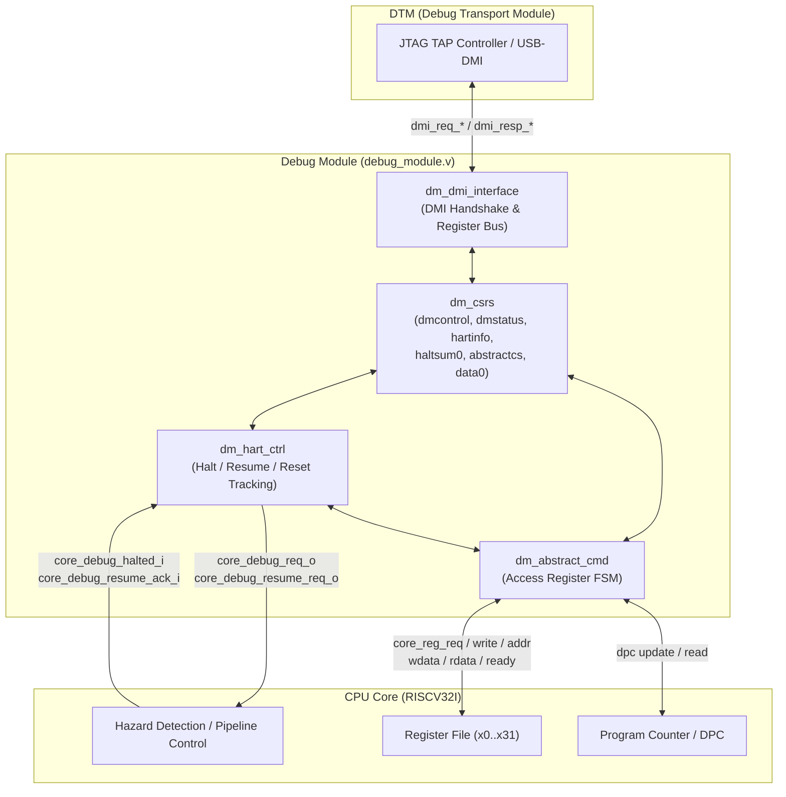

# Khối Debug Module (DM) & Debug Module Interface (DMI) theo chuẩn RISC-V

Thư mục này chứa khối **Debug Module (DM)** và **Debug Module Interface (DMI)** được thiết kế tuân thủ theo chuẩn **RISC-V Debug Specification v0.13.2 / v1.0.0**, phục vụ tích hợp trực tiếp vào core CPU RISC-V 32-bit (RV32I).

Toàn bộ RTL tổng hợp được viết bằng **Verilog-2001** theo phong cách ASIC, không phụ thuộc thư viện UVM hay thuộc tính FPGA (`ram_style`, `use_dsp`). Module wrapper `DMI_if.sv` dùng SystemVerilog theo chuẩn chung của repository.

---

## 1. Cấu trúc thư mục

```text
00_src/DMI/
├── README.md                # Tài liệu kỹ thuật chi tiết
├── DMI_if.sv                # Wrapper SystemVerilog theo chuẩn module core (*_if.sv)
├── rtl/
│   ├── dm_defines.v         # Định nghĩa địa chỉ DMI, bitfield và hằng số chuẩn
│   ├── dm_dmi_interface.v   # Khối giao tiếp bus DMI từ DTM (JTAG/USB)
│   ├── dm_csrs.v            # Bảng thanh ghi điều khiển & trạng thái (CSRs) của DM
│   ├── dm_hart_ctrl.v       # Khối điều khiển trạng thái Hart (Halt, Resume, Reset-Halt)
│   ├── dm_abstract_cmd.v    # Khối thực thi lệnh trừu tượng (Abstract Command Engine)
│   └── debug_module.v       # Top-level Debug Module (kết nối DMI và Core)
└── tb/
    └── debug_module_tb.v    # Testbench tự kiểm tra (self-checking) toàn diện
```

| File | Module chính | Chức năng |
| :--- | :--- | :--- |
| `dm_defines.v` | *(Header / Macro)* | Địa chỉ thanh ghi DMI, mã thao tác, bitfield `dmcontrol`, `dmstatus`, `abstractcs`, `command`, `dcsr` |
| `dm_dmi_interface.v` | `dm_dmi_interface` | Bắt tay giao thức DMI (`req/resp`, `valid/ready`, `op/data`), phân xử bus thanh ghi nội bộ |
| `dm_csrs.v` | `dm_csrs` | Lưu trữ và xử lý các thanh ghi DMI: `dmcontrol`, `dmstatus`, `hartinfo`, `abstractcs`, `data0`, `haltsum0` |
| `dm_hart_ctrl.v` | `dm_hart_ctrl` | Quản lý trạng thái Hart: sinh tín hiệu ngắt debug `haltreq`, xung `resumereq`, theo dõi `halted`/`running`/`havereset` |
| `dm_abstract_cmd.v` | `dm_abstract_cmd` | Bộ điều khiển FSM lệnh trừu tượng Access Register (đọc/ghi GPR `x0..x31`, `dpc`, `dcsr`), bắt lỗi `cmderr` |
| `debug_module.v` | `debug_module` | Top module tích hợp toàn bộ các khối DMI, CSR, Hart Control và Abstract Engine |
| `DMI_if.sv` | `DMI_if` | Wrapper SystemVerilog bọc `debug_module` đồng bộ với format `CORE_if.sv`, `IF_if.sv` |
| `debug_module_tb.v` | `debug_module_tb` | Testbench tự kiểm chứng 14 kịch bản chuẩn (kích hoạt, dừng, ghi/đọc thanh ghi, phục hồi, bắt lỗi) |

---

## 2. Kiến trúc khối Debug Module



---

## 3. Bảng thanh ghi DMI (DMI Register Map)

Hỗ trợ không gian địa chỉ DMI 7-bit theo RISC-V Debug Spec 0.13.2:

| Địa chỉ DMI | Tên thanh ghi | Quyền | Mô tả chi tiết |
| :---: | :--- | :---: | :--- |
| `0x04` | `data0` | R/W | Dữ liệu trừu tượng 32-bit (dùng trao đổi dữ liệu thanh ghi GPR/CSR với debugger) |
| `0x10` | `dmcontrol` | R/W | Điều khiển Debug Module: `dmactive` (bit 0), `ndmreset` (bit 1), `hartsel` (bits 25:16), `clrresethaltreq` (bit 26), `setresethaltreq` (bit 27), `resumereq` (bit 30), `haltreq` (bit 31) |
| `0x11` | `dmstatus` | RO | Trạng thái Debug Module: phiên bản 0.13 (`version = 4'h2`), `hasresethaltreq` (bit 5), `authenticated` (bit 7), `anyhalted` (bit 8), `allhalted` (bit 9), `anyrunning` (bit 10), `allrunning` (bit 11), `anyresumeack` (bit 16), `allresumeack` (bit 17), `anyhavereset` (bit 18), `allhavereset` (bit 19) |
| `0x12` | `hartinfo` | RO | Thông tin Hart: số thanh ghi data (`datasize = 1`), số thanh ghi dscratch (`nscratch = 1`), không shadow bộ nhớ (`dataaccess = 0`) |
| `0x13` / `0x40` | `haltsum0` | RO | Tóm tắt trạng thái halt: bit `0` bằng `1` khi Hart 0 đang halted |
| `0x16` | `abstractcs` | R/W | Trạng thái lệnh trừu tượng: số data register (`datacount = 1`), cờ `busy` (bit 12), mã lỗi `cmderr` (bits 10:8, xóa bằng cách ghi 1 - W1C) |
| `0x17` | `command` | WO | Thanh ghi thực thi lệnh trừu tượng (ghi opcode Access Register để bắt đầu lệnh) |
| `0x18` | `abstractauto`| R/W | Tự động thực thi lại lệnh khi đọc/ghi vào `data0` (`autoexecdata[0]`) |

---

## 4. Lệnh trừu tượng (Abstract Command: Access Register)

Debug Module hỗ trợ lệnh **Access Register** (`cmdtype = 8'h00`):

```text
31      24 23 22    20 19                18       17       16 15                    0
+---------+--+--------+------------------+--------+--------+--+---------------------+
| cmdtype |0 | aarsize| aarpostincrement |postexec|transfer|w |        regno        |
+---------+--+--------+------------------+--------+--------+--+---------------------+
```

- `cmdtype = 8'h00`: Lệnh Access Register.
- `aarsize = 3'd2`: Chuyển dữ liệu đúng 32-bit (hỗ trợ kiến trúc RV32).
- `transfer = 1`: Thực hiện truyền dữ liệu giữa thanh ghi core và `data0`.
- `write = 0`: Đọc thanh ghi vào `data0`.
- `write = 1`: Ghi dữ liệu từ `data0` vào thanh ghi.
- Các thanh ghi hỗ trợ truy cập qua trường `regno[15:0]`:
  - `0x1000` – `0x101F`: 32 thanh ghi đa năng GPR (`x0` đến `x31`). Thanh ghi `x0` luôn bảo toàn giá trị `0`.
  - `0x07B0`: `dcsr` (Debug Control & Status).
  - `0x07B1`: `dpc` (Debug PC - con trỏ lệnh khi vào Debug Mode).
  - `0x07B2`: `dscratch0` (Thanh ghi cào phục vụ debug).

### Mã lỗi `cmderr` (trong thanh ghi `abstractcs`):
- `3'd0` (`CMDERR_NONE`): Không có lỗi.
- `3'd1` (`CMDERR_BUSY`): Cố ghi lệnh mới khi module đang bận thực thi lệnh trước.
- `3'd2` (`CMDERR_NOT_SUPPORTED`): Lệnh không được hỗ trợ (`cmdtype != 0`, `aarsize != 2`, hoặc bật `postexec`).
- `3'd4` (`CMDERR_HALT_RESUME`): Cố thực hiện lệnh trừu tượng khi Hart **chưa ở trạng thái HALTED**.

---

## 5. Danh sách cổng giao tiếp (Interface Ports)

### 5.1. DMI Slave Interface (Nối với DTM / JTAG TAP)
- `dmi_req_valid_i` (1-bit): Báo có request từ DTM.
- `dmi_req_ready_o` (1-bit): DM sẵn sàng nhận request.
- `dmi_req_address_i` (7-bit): Địa chỉ thanh ghi DMI.
- `dmi_req_data_i` (32-bit): Dữ liệu ghi DMI.
- `dmi_req_op_i` (2-bit): `00`: NOP, `01`: Read, `10`: Write.
- `dmi_resp_valid_o` (1-bit): Báo response hợp lệ từ DM.
- `dmi_resp_ready_i` (1-bit): DTM sẵn sàng nhận response.
- `dmi_resp_data_o` (32-bit): Dữ liệu đọc DMI.
- `dmi_resp_op_o` (2-bit): `00`: Success, `01`: Failed, `10`: Busy.

### 5.2. Core Control & Status Interface (Nối với Core RISCV)
- `core_debug_req_o` (1-bit): Yêu cầu core dừng vào Debug Mode (halt request).
- `core_debug_resume_req_o` (1-bit): Xung yêu cầu core thoát Debug Mode tiếp tục chạy (resume request).
- `core_debug_resethalt_req_o` (1-bit): Yêu cầu core dừng ngay sau khi nhả reset.
- `core_debug_halted_i` (1-bit): Core báo đang ở trạng thái dừng (pipeline đã xả sạch).
- `core_debug_resume_ack_i` (1-bit): Core báo đã nhận lệnh resume và quay lại chạy.
- `core_debug_cause_i` (3-bit): Nguyên nhân dừng (`3'd3`: haltreq, `3'd1`: ebreak, `3'd4`: step).
- `ndmreset_o` (1-bit): Reset toàn hệ thống/core (Non-Debug Module Reset).
- `dmactive_o` (1-bit): Trạng thái hoạt động của Debug Module.

### 5.3. Core Direct Register Access Interface (Đọc/Ghi GPR & PC)
- `core_reg_req_o` (1-bit): Yêu cầu truy cập thanh ghi core.
- `core_reg_write_o` (1-bit): `1`: Ghi, `0`: Đọc.
- `core_reg_addr_o` (16-bit): Địa chỉ thanh ghi (`0x1000..0x101F` cho `x0..x31`, `0x07B1` cho DPC).
- `core_reg_wdata_o` (32-bit): Dữ liệu ghi vào thanh ghi core.
- `core_reg_rdata_i` (32-bit): Dữ liệu đọc từ thanh ghi core.
- `core_reg_ready_i` (1-bit): Báo hoàn tất truy cập (thường 1 chu kỳ).

---

## 6. Hướng dẫn tích hợp chi tiết vào Core `RISCV.v`

### 6.1. Tạm dừng Pipeline trong `hazard_detection.v`
Trong [`00_src/Top/rtl/hazard_detection.v`](../Top/rtl/hazard_detection.v):
```verilog
// Khi nhận yêu cầu dừng debug từ DM:
// 1. Đóng băng PC:
assign write_PC_o = hazard_stall ? 1'b0 : (core_debug_req_i ? 1'b0 : 1'b1);

// 2. Chèn bubble để xả sạch các lệnh đang dở dang trong pipeline:
// Khi các tầng EX, MEM, WB đều đã thực hiện xong lệnh cuối cùng, phát tín hiệu:
assign core_debug_halted_o = pipeline_empty_w && core_debug_req_i;
```

### 6.2. Ghép kênh truy cập Register File trong `register_file.v`
Trong [`00_src/Decode_stage/rtl/register_file.v`](../Decode_stage/rtl/register_file.v):
```verilog
// Ghép kênh cổng ghi:
wire [4:0]  rf_waddr_w = core_debug_halted_i ? core_reg_addr_i[4:0] : write_rd_i;
wire [31:0] rf_wdata_w = core_debug_halted_i ? core_reg_wdata_i     : write_back_data_i;
wire        rf_wen_w   = core_debug_halted_i ? (core_reg_req_i & core_reg_write_i) : reg_write_en_i;

// Ghép kênh cổng đọc debug:
assign core_reg_rdata_o = (core_reg_addr_i[4:0] == 5'd0) ? 32'b0 : register_array[core_reg_addr_i[4:0]];
assign core_reg_ready_o = 1'b1; // Đọc bất đồng bộ hoặc phản hồi sau 1 clock
```

### 6.3. Lưu và nạp lại DPC trong `program_counter.v`
Trong [`00_src/Fetch_stage/rtl/program_counter.v`](../Fetch_stage/rtl/program_counter.v):
- Khi core bắt đầu halt, chốt địa chỉ lệnh kế tiếp vào thanh ghi `dpc_q`.
- Khi debugger ghi `dpc` qua Abstract Command, cập nhật `dpc_q <= core_reg_wdata_i`.
- Khi nhận `core_debug_resume_req_o`, nạp lại `PC <= dpc_q` để tiếp tục chạy từ địa chỉ chỉ định.

---

## 7. Kiểm chứng (Verification)

Mô phỏng và kiểm tra testbench tự động bằng Verilator:

```bash
cd /data/workspaces/khoatna/workspace/myWork/RISCV32I
verilator --binary --timescale 1ns/1ps -Wall -Wno-style -Wno-UNUSEDSIGNAL -sv \
  +incdir+00_src/DMI/rtl \
  00_src/DMI/rtl/dm_defines.v \
  00_src/DMI/rtl/dm_dmi_interface.v \
  00_src/DMI/rtl/dm_csrs.v \
  00_src/DMI/rtl/dm_hart_ctrl.v \
  00_src/DMI/rtl/dm_abstract_cmd.v \
  00_src/DMI/rtl/debug_module.v \
  00_src/DMI/tb/debug_module_tb.v \
  --top-module debug_module_tb -o Vdebug_module_tb

./obj_dir/Vdebug_module_tb
```

Kết quả mô phỏng:
```text
=================================================================
  STARTING RISC-V DEBUG MODULE (DM) TESTBENCH
=================================================================
[PASS] Check DM Inactive after reset | Addr: 0x10 Read: 0x00000000 (Expected: 0x00000000)
[PASS] Check dmcontrol dmactive = 1 | Addr: 0x10 Read: 0x00000001 (Expected: 0x00000001)
[PASS] Check dmstatus initial running | Addr: 0x11 Read: 0x000c0ca2 (Expected: 0x00000ca2)
[PASS] core_debug_req_o asserted on haltreq
[PASS] Check dmstatus allhalted = 1 | Addr: 0x11 Read: 0x000c03a2 (Expected: 0x000003a2)
[PASS] Check haltsum0 bit 0 = 1 | Addr: 0x13 Read: 0x00000001 (Expected: 0x00000001)
[PASS] GPR x5 written with 0xDEADBEEF via Abstract Command
[PASS] Read GPR x5 back from data0 | Addr: 0x04 Read: 0xdeadbeef (Expected: 0xdeadbeef)
[PASS] DPC written with 0x00001000
[PASS] Read DPC back from data0 | Addr: 0x04 Read: 0x00001000 (Expected: 0x00001000)
[PASS] Check dmstatus allrunning = 1 after resume | Addr: 0x11 Read: 0x000f0ca2 (Expected: 0x00000ca2)
[PASS] Check cmderr = 4 (halt/resume error) | Addr: 0x16 Read: 0x00000401 (Expected: 0x00000400)
[PASS] Check cmderr cleared to 0 | Addr: 0x16 Read: 0x00000001 (Expected: 0x00000000)
[PASS] ndmreset asserted correctly
=================================================================
  TEST SUMMARY
  Total Checks Passed: 14
  Total Checks Failed: 0
  STATUS: ALL TESTS PASSED
=================================================================
```
