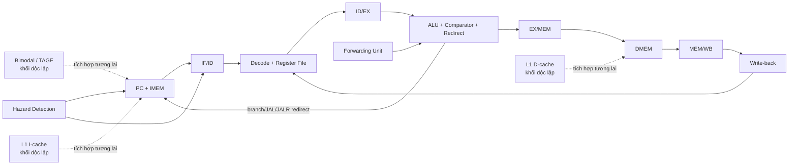

# RISCV32I — CPU RISC-V 32-bit pipeline 5 tầng

> Cập nhật trạng thái source: 26/07/2026
>
> README này mô tả những gì thực sự tồn tại trong repository. Một module được
> ghi là **khối độc lập** không có nghĩa là module đó đã được nối vào
> `00_src/Top/rtl/RISCV.v`.

## Tổng quan

Repository triển khai một CPU RISC-V 32-bit theo pipeline 5 tầng
`IF → ID → EX → MEM → WB`. Datapath hiện tại thực thi nhóm lệnh tính toán,
load/store và control-flow của RV32I, có forwarding, load-use stall và flush khi
branch/jump đổi luồng.

Ngoài core chính, repository đã có các khối nghiên cứu độc lập:

- L1 I-cache và D-cache blocking, fully-associative.
- Bộ dự đoán nhánh bimodal counter 2-bit.
- Bộ dự đoán nhánh Compact TAGE-3.
- Môi trường kiểm thử SystemVerilog theo cấu trúc UVM cơ bản nhưng không dùng
  thư viện UVM.
- Luồng bare-metal RISC-V GNU Toolchain để tạo assembly, ELF, disassembly,
  binary và `IMEM.mem`.
- Mười chương trình assembly RV32I dùng để kiểm tra CPU.

Core chưa phải một implementation RISC-V architectural-compliant hoàn chỉnh vì
chưa có trap chính xác, CSR, privilege mode, interrupt và external memory bus.

## Trạng thái hiện tại

| Thành phần | Trạng thái source | Tích hợp vào `RISCV.v` | Trạng thái kiểm chứng |
| --- | --- | --- | --- |
| RV32I pipeline 5 tầng | Đã viết | Có | Có regression self-checking; cần chạy lại để chốt kết quả theo source/commit hiện tại |
| Forwarding và hazard control | Đã viết | Có | Được kiểm tra trong regression core |
| IMEM/DMEM mô phỏng | Đã viết | Có | Dùng trong regression và chương trình bare-metal |
| Testbench class/mailbox không-UVM | Đã viết, 40 directed cases | Có | Cần chạy lại và lưu log mới |
| Testbench waveform/disassembler | Đã viết | Có | Hiển thị chuỗi assembly và vector ASCII trên Vivado waveform |
| L1 I-cache/D-cache | Khối độc lập, style ASIC | Chưa | Testbench có 38 checks; chưa chạy lại sau refactor |
| Bimodal predictor 2-bit | Khối độc lập | Chưa | Chưa có testbench riêng trong folder |
| Compact TAGE-3 | Khối độc lập, style ASIC | Chưa | Có 4 testbench Verilog; chưa chạy lại sau refactor |
| C-to-IMEM tool flow | Đã viết | Không áp dụng | Source toolchain đã clone; executable compiler local chưa được build/cài |
| 10 thuật toán assembly RV32I | Đã viết | Chạy qua IMEM/DMEM | Chưa có regression tự động nối toàn bộ signature với core |
| RV32M | Chưa triển khai | Chưa | Mới có hằng encoding, chưa có execution unit/decode/test |
| Trap/CSR/interrupt | Chưa triển khai | Chưa | Chưa có |
| External bus/MMIO | Chưa triển khai | Chưa | Chưa có |

Các số `82 PASS / 0 FAIL`, `40 PASS / 0 FAIL` và kết quả cache từng được ghi
nhận ở các lần chạy trước không được xem là kết quả của source hiện tại cho tới
khi regression được chạy lại, kèm simulator, phiên bản tool, ngày và commit.

## Kiến trúc core hiện tại



### IF — Instruction Fetch

- PC tăng `4` trong luồng tuần tự.
- IMEM đọc instruction theo byte address.
- PC và IF/ID được giữ khi có load-use stall.
- Redirect từ EX flush instruction ở đường sai.

### ID — Instruction Decode

- Decode opcode, `funct3`, `funct7` và sinh control signal.
- Đọc register file và tạo immediate các dạng I/S/B/U/J.
- Có WB-to-ID write-through khi đọc và ghi cùng register tại một cạnh clock.
- Không cho phép ghi thay đổi `x0`.

### EX — Execute

- ALU, comparator, branch target và jump target.
- Forwarding EX/MEM có ưu tiên cao hơn MEM/WB.
- Forwarding độc lập cho operand A, operand B và store data.
- JALR target được ép bit `0` về `0`.

### MEM — Memory Access

- Hỗ trợ load byte, halfword, word có sign/zero extension.
- Hỗ trợ store byte, halfword và word.
- DMEM hiện đọc bất đồng bộ, ghi tại cạnh lên.

### WB — Write Back

- Chọn kết quả ALU hoặc dữ liệu load.
- Ghi kết quả về register file khi instruction hợp lệ.

## RV32I đã có trong datapath

| Nhóm | Instruction | Trạng thái |
| --- | --- | --- |
| Register-register | `ADD SUB SLL SLT SLTU XOR SRL SRA OR AND` | Đã triển khai |
| Register-immediate | `ADDI SLTI SLTIU XORI ORI ANDI SLLI SRLI SRAI` | Đã triển khai |
| Upper immediate | `LUI AUIPC` | Đã triển khai |
| Load | `LB LH LW LBU LHU` | Đã triển khai |
| Store | `SB SH SW` | Đã triển khai |
| Branch | `BEQ BNE BLT BGE BLTU BGEU` | Đã triển khai |
| Jump | `JAL JALR` | Đã triển khai |
| Memory ordering | `FENCE`, `FENCE.I` | Decode như no-op trong memory model hiện tại |
| System | `ECALL`, `EBREAK`, CSR | Chưa phát trap/chưa có CSR |
| Illegal encoding | Các encoding không hợp lệ | Bị chặn side effect nhưng chưa phát illegal-instruction trap |

Các macro RV32M, exception và CSR trong
[`riscv_defines.v`](00_src/Defines/riscv_defines.v) chỉ là hằng encoding/ID.
Chúng không chứng minh rằng datapath tương ứng đã được triển khai.

## Hazard và control-flow

Core hiện có:

- EX/MEM forwarding.
- MEM/WB forwarding khi không có producer mới hơn.
- Store-data forwarding.
- Một bubble cho load-use dependency với DMEM bất đồng bộ hiện tại.
- Giữ đồng thời PC và IF/ID trong chu kỳ stall.
- Flush IF/ID và ID/EX khi branch taken, JAL hoặc JALR redirect tại EX.
- Loại false dependency với `rd = x0` và instruction không dùng `rs1`/`rs2`.

Core chưa có pipeline-wide `valid/stall/kill` đủ tổng quát. Đây là giới hạn quan
trọng trước khi thêm cache miss, memory latency thay đổi, divider nhiều chu kỳ,
branch prediction và precise trap.

## Memory model hiện tại

### IMEM

- Byte array 1024 byte, địa chỉ hợp lệ để fetch word đến `1020`.
- Mỗi instruction được lưu thành bốn byte theo thứ tự MSB trước.
- Ví dụ `00 50 02 93` tạo instruction `0x00500293`
  (`addi x5, x0, 5`).
- Khi không có `IMEM_FILE`, IMEM được điền NOP.
- Ngoài vùng hợp lệ, IMEM trả NOP.

### DMEM

- Mô hình byte address từ `0` đến `2048`.
- Bốn byte-bank, word little-endian.
- Byte có thể truy cập tại mọi byte address hợp lệ.
- Halfword phải aligned 2 byte; word phải aligned 4 byte.
- Truy cập lệch hàng hoặc ngoài vùng bị chặn nhưng chưa tạo exception.

IMEM và DMEM dùng `initial`, vòng lặp khởi tạo và `$readmemh`; đây là memory
model phục vụ mô phỏng, chưa phải SRAM/BRAM wrapper dành cho FPGA/ASIC.

## Các khối đã hoàn thành ở dạng độc lập

### L1 I-cache và D-cache

Folder [`00_src/Cache`](00_src/Cache) chứa:

- `l1_icache_fa.v`: blocking, read-only, read-allocate và invalidate.
- `l1_dcache_fa.v`: blocking, write-back, write-allocate, byte strobe, dirty
  eviction và flush.
- Replacement ưu tiên way invalid, sau đó dùng round-robin xác định.
- Invalidate/flush đến khi cache bận được ghi nhớ để xử lý sau request hiện tại.
- Mặc định 4 line × 4 word × 32 bit; RTL hiện hỗ trợ tối đa 4 way và
  `WORDS_PER_LINE = 1, 2, 4, 8, 16`.
- Giao tiếp CPU và backing memory dùng valid/ready, một request outstanding.

Cache đã được refactor theo hướng ASIC:

- Không dùng vòng `for` trong RTL hoặc testbench.
- Không dùng `initial` trong RTL.
- Không reset tag/data array; chỉ reset metadata/control.
- Không phụ thuộc `ram_style` hoặc `use_dsp`.

Cache chưa được nối vào IF/MEM. Core phải có global stall và ready/valid trước
khi cache miss có thể được xử lý đúng. MMIO bypass, coherence, ECC/parity,
atomic, multiple outstanding request và response error vẫn chưa có.

### Bimodal branch predictor 2-bit

Folder [`00_src/branch_prediction`](00_src/branch_prediction) chứa bảng counter
bão hòa 2-bit, mặc định 64 entry, direct-index theo PC.

Khối này:

- Chỉ dự đoán hướng taken/not-taken.
- Chưa có BTB, target prediction hoặc return-address stack.
- Chưa được nối vào `RISCV.v`.
- Chưa có testbench riêng.
- Vẫn dùng style hướng FPGA (`initial`, vòng `for`, `ram_style`, `use_dsp`);
  chưa được refactor theo style ASIC như Cache/TAGE.

### Compact TAGE-3

Folder [`00_src/TAGE`](00_src/TAGE) chứa sáu module RTL:

1. `tage_global_history`
2. `tage_hash`
3. `tage_base_table`
4. `tage_tagged_table`
5. `tage_provider_selector`
6. `tage_predictor`

Cấu hình mặc định:

| Thành phần | Cấu hình |
| --- | --- |
| Base table | 64 entry, counter 2-bit |
| Tagged table 1 | 32 entry, history 4, tag 6-bit |
| Tagged table 2 | 32 entry, history 12, tag 7-bit |
| Tagged table 3 | 32 entry, history 32, tag 8-bit |
| Tagged counter | 3-bit |
| Usefulness | 1-bit |
| Global history | 32-bit |

TAGE hiện có provider/alternate selection, allocation round-robin, usefulness
training/aging, committed history và speculative history có recovery.

RTL TAGE đã được refactor theo hướng ASIC:

- Mỗi file đúng một module Verilog.
- Không có `for`, `while`, `repeat`, `initial`, FPGA attribute, `ram_style` hoặc
  `use_dsp` trong RTL.
- Hash được XOR-fold và unroll bằng phép dịch/XOR hằng.
- Tag/counter/usefulness/data array không reset.
- Validity plane được reset để che dữ liệu chưa khởi tạo.
- `RESET_ON_SOFT_RESET` được giữ để tương thích source; cả hai giá trị hiện đều
  invalidate metadata khi reset.

Giới hạn hiện tại:

- Hash hỗ trợ tối đa 32 bit history theo implementation hiện tại.
- Array lookup bất đồng bộ có thể tổng hợp thành FF/mux; SRAM macro thật cần
  wrapper, banking/replication hoặc thêm latency đọc.
- Chưa có BTB, RAS, loop predictor hay statistical corrector.
- Chưa pipeline prediction context và checkpoint/recovery vào core.
- Bốn testbench Verilog đã có nhưng chưa chạy lại sau refactor.

README con trong `00_src/TAGE` còn mô tả một số hành vi FPGA/reset cũ; trạng thái
trong README gốc này được ưu tiên cho source hiện tại và phần tài liệu con cần
được đồng bộ ở một mốc sau.

## Môi trường kiểm thử

| Testbench/flow | Vị trí | Mục đích | Trạng thái |
| --- | --- | --- | --- |
| `RISCV32I_regression_tb` | `04_testbench/uvm` | Directed RV32I và sequence hazard/control-flow self-checking | Source có sẵn; cần chạy lại |
| `RISCV32I_tb` | `04_testbench/uvm` | Packet/Generator/Driver/Monitor/Scoreboard/Test bằng class/mailbox, không dùng thư viện UVM | 40 directed cases; cần chạy lại |
| `RISCV_tb` | `04_testbench/vivado` | Nạp IMEM và hiện assembly dạng `string`/ASCII trên waveform | Source có sẵn |
| `cache_l1_tb` | `00_src/Cache` | Self-checking I-cache/D-cache | 38 checks; chưa chạy lại |
| `tage_global_history_tb` | `00_src/TAGE/tb` | Committed/speculative history và recovery | Chưa chạy lại |
| `tage_provider_selector_tb` | `00_src/TAGE/tb` | Provider/alternate priority | Chưa chạy lại |
| `tage_tagged_table_tb` | `00_src/TAGE/tb` | Tag, counter, usefulness, aging và ASIC reset | Chưa chạy lại |
| `tage_predictor_tb` | `00_src/TAGE/tb` | Regression tích hợp Compact TAGE | Chưa chạy lại |
| Verilator C++ harness | `04_testbench/verilator` | Wrapper và waveform phía C++ | Đường dẫn Makefile/filelist hiện cần sửa |

Folder `04_testbench/uvm` chỉ mô phỏng cấu trúc UVM cơ bản. Nó không import
`uvm_pkg`, không dùng macro UVM và không cần thư viện UVM.

Hiện chưa có một filelist thống nhất, đã kiểm tra, chạy được từ repo root:

- `03_sim/Makefile` còn trỏ tới một số file testbench ở vị trí cũ.
- `04_testbench/verilator/filelist_tb.f` còn trỏ tới file trực tiếp dưới
  `04_testbench`, trong khi source hiện nằm trong các subfolder.
- Repository không kèm Vivado `.xpr`.

Vì vậy cần sửa và chạy lại flow trước khi ghi `make all` hoặc một lệnh XSim cụ
thể là luồng chính thức.

## Bare-metal C compiler và assembly tests

Folder [`04_testbench/c_compiler`](04_testbench/c_compiler) cung cấp:

- `Makefile` mặc định `ARCH=rv32i`, `ABI=ilp32`.
- `startup.S`, `linker.ld` và `example.c`.
- Target `asm`, `program`, `disasm`, `imem`, `deploy-imem`, `doctor`, `test` và
  `test-all`.
- Script chuyển binary little-endian thành định dạng byte MSB-trước mà
  `IMEM.v` sử dụng.
- Source `riscv-collab/riscv-gnu-toolchain` đã clone cùng Binutils, GCC và
  Newlib; source/build output lớn được `.gitignore` loại khỏi repo chính.

Source toolchain đã có nhưng `tools/riscv-gnu-toolchain/install/bin` chưa có
compiler đã build. Có thể dùng một RISC-V GNU Toolchain khác trong `PATH` hoặc
build/install toolchain local trước.

Ví dụ:

```powershell
cd 04_testbench\c_compiler
mingw32-make doctor
mingw32-make asm
mingw32-make program
mingw32-make test TEST_NAME=01_arithmetic_series
mingw32-make test-all
```

Mười thuật toán assembly RV32I:

1. Tổng cấp số số học.
2. Fibonacci.
3. Factorial bằng cộng lặp.
4. GCD bằng phép trừ.
5. Chia và lấy dư bằng phép trừ.
6. Popcount.
7. Bubble sort.
8. Binary search.
9. CRC-8.
10. Memory copy và checksum.

Các test tránh RV32M và ghi signature PASS/FAIL cùng actual/expected vào DMEM.
Runtime hiện không có libc, syscall, heap, interrupt hoặc tự động khởi tạo
`.data/.bss`.

## Cấu trúc repository

```text
RISCV32I/
├── 00_src/
│   ├── Defines/
│   │   └── riscv_defines.v
│   ├── Fetch_stage/
│   │   ├── rtl/
│   │   └── IF_if.sv
│   ├── Decode_stage/
│   │   ├── rtl/
│   │   └── ID_if.sv
│   ├── Execute_stage/
│   │   ├── rtl/
│   │   └── EXE_if.sv
│   ├── Memory_stage/
│   │   ├── rtl/
│   │   └── MEM_if.sv
│   ├── Top/
│   │   ├── rtl/
│   │   │   ├── RISCV.v
│   │   │   ├── forwarding.v
│   │   │   └── hazard_detection.v
│   │   └── CORE_if.sv
│   ├── branch_prediction/
│   │   └── rtl/branch_predictor_2bit.v
│   ├── Cache/
│   │   ├── l1_icache_fa.v
│   │   ├── l1_dcache_fa.v
│   │   ├── cache_backing_memory.v
│   │   ├── cache_l1_tb.v
│   │   └── cache_filelist.f
│   └── TAGE/
│       ├── rtl/
│       └── tb/
├── 01_data_mem/
│   ├── IMEM.mem
│   └── DMEM.mem
├── 02_testlist/                 # C++ harness prototype/legacy
├── 03_sim/                      # Makefile/filelist Verilator legacy
├── 04_testbench/
│   ├── c_compiler/
│   │   ├── test/
│   │   └── tools/
│   ├── uvm/                     # UVM-like, không cần thư viện UVM
│   ├── verilator/
│   └── vivado/
├── .gitignore
└── README.md
```

Các file `*_if.sv` là wrapper module, không phải SystemVerilog `interface`.

## Roadmap phát triển

Roadmap được sắp theo dependency kỹ thuật. Mỗi phase chỉ được đánh dấu hoàn
thành khi đã tích hợp vào top-level và đạt tiêu chí kiểm chứng, không chỉ khi đã
có một module độc lập.

### Phase 0 — Ổn định baseline và tái tạo kết quả

Trạng thái: **đang cần thực hiện**.

1. Sửa đường dẫn trong `03_sim/Makefile` và các filelist XSim/Verilator.
2. Tạo một lệnh thống nhất từ repo root để lint, compile và chạy từng suite.
3. Chạy lại core, Cache và TAGE; lưu tool/version/date/commit cùng summary.
4. Tách generated output khỏi source tree và giữ `.gitignore` đồng bộ.
5. Thêm kiểm tra compile Verilog-2001/SystemVerilog và Markdown vào CI.
6. Đồng bộ README con của Cache/TAGE/branch predictor với source.

Điều kiện hoàn thành:

- Clone sạch có thể chạy regression bằng tài liệu duy nhất.
- Mismatch trả exit code khác `0`.
- Không dùng số PASS cũ làm trạng thái của source mới.

### Phase 1 — Control backbone và memory handshake

1. Thêm valid bit cho từng pipeline stage.
2. Chuẩn hóa thứ tự ưu tiên `reset > trap/recovery > flush > stall > advance`.
3. Thêm ready/valid cho instruction và data memory.
4. Cho phép stall toàn pipeline khi memory chưa trả response.
5. Thêm kill/cancel cho instruction ở đường sai.
6. Thêm retirement interface tối thiểu: PC, instruction, `rd`, write data,
   memory side effect và trap metadata.
7. Kiểm tra với memory latency ngẫu nhiên và backpressure.

Đây là nền tảng bắt buộc cho cache miss, divider nhiều chu kỳ, branch prediction
và precise exception.

### Phase 2 — Precise trap, Machine mode và Zicsr

1. Pipeline exception metadata và chỉ commit side effect của instruction hợp lệ
   lớn tuổi nhất.
2. Triển khai illegal instruction, `ECALL`, `EBREAK`, instruction/load/store
   misalignment và access fault.
3. CSR tối thiểu: `mstatus`, `misa`, `mie`, `mtvec`, `mscratch`, `mepc`,
   `mcause`, `mtval`, `mip`, `mcycle`, `minstret`.
4. Triển khai sáu instruction CSR và `MRET`.
5. Bổ sung machine software/timer/external interrupt cơ bản.
6. Ghi rõ phiên bản Unprivileged/Privileged Specification được dùng làm chuẩn.

### Phase 3 — RV32M

1. Thêm đủ `MUL`, `MULH`, `MULHSU`, `MULHU`, `DIV`, `DIVU`, `REM`, `REMU`.
2. Chọn kiến trúc rõ ràng:
   - multiplier tổ hợp/pipeline nếu ưu tiên hiệu năng;
   - multiplier/divider iterative nếu ưu tiên diện tích.
3. Với unit nhiều chu kỳ, dùng handshake `request/busy/done` và hỗ trợ hủy khi
   flush/trap.
4. Kiểm tra divide-by-zero, signed overflow `INT_MIN / -1`, high-word signed,
   unsigned và signed×unsigned.
5. Có parameter bật/tắt RV32M; khi tắt, encoding M phải phát illegal trap.
6. Chỉ đổi toolchain sang `-march=rv32im` sau khi RV32I và RV32M regression cùng
   đạt yêu cầu.

### Phase 4 — Memory system, L1 cache và Zifencei

1. Tách IMEM/DMEM behavioral model khỏi interface core.
2. Viết adapter IF↔I-cache và MEM↔D-cache.
3. Thêm uncached/MMIO address filter.
4. Kiểm tra hit, miss, refill, dirty eviction, flush, invalidate và
   backpressure.
5. Hoàn thiện `FENCE.I`: flush dữ liệu liên quan rồi invalidate instruction
   cache theo memory model đã chọn.
6. Chọn external bus đầu tiên, ví dụ AXI4-Lite hoặc Wishbone.
7. Khi dùng SRAM/BRAM đọc đồng bộ, thêm state/pipeline latency và wrapper công
   nghệ thay vì phụ thuộc lookup array bất đồng bộ.

### Phase 5 — Branch prediction

1. Tích hợp predictor 2-bit trước để hoàn thiện:
   - branch-valid;
   - predicted direction/PC metadata qua pipeline;
   - recovery PC cho cả predicted-taken sai và predicted-not-taken sai.
2. Thêm BTB để dự đoán target và RAS cho call/return nếu cần.
3. Thay predictor direction bằng TAGE committed-history.
4. Chỉ bật speculative history khi có checkpoint/recovery cho branch, jump,
   trap và interrupt.
5. Thêm counter đo branch, misprediction, accuracy, CPI và IPC.
6. So sánh no-predictor, bimodal và TAGE theo accuracy, area và Fmax.

### Phase 6 — SoC bare-metal

1. Chuẩn hóa memory map.
2. Thêm boot ROM/RAM wrapper.
3. Thêm UART, timer, GPIO và interrupt controller tối thiểu.
4. Cập nhật linker script/startup để có stack, `.data`, `.bss` và MMIO.
5. Chạy chương trình C nhiều file và firmware bare-metal thực tế.

### Phase 7 — Các extension tiếp theo

Thứ tự đề xuất:

1. `Zba`, `Zbb`, `Zbs` — chủ yếu mở rộng ALU.
2. `RV32C` — cần PC `+2/+4`, halfword fetch, decompressor và IALIGN mới.
3. `RV32A` — chỉ sau khi memory/cache hỗ trợ reservation, AMO và quy tắc
   MMIO/coherence rõ ràng.
4. `RV32F`, sau đó `RV32D` — cần FP register file, `fcsr`, rounding mode,
   exception flag và precise commit.
5. `RV32V` — mục tiêu dài hạn do cần vector register file, lane datapath và
   memory bandwidth lớn.

Nếu mục tiêu là chạy Linux, tạo một nhánh roadmap riêng sau khi Machine mode và
memory subsystem ổn định: S-mode, PMP, Sv32 MMU/TLB, page fault và nền tảng
interrupt/timer phù hợp.

### Phase 8 — FPGA và ASIC signoff

FPGA:

- Chọn chính sách BRAM/DSP có số liệu.
- Viết XDC, clock/reset wrapper và top cho board.
- Lưu utilization, timing, Fmax và power report.
- Chạy chương trình qua UART/timer/boot memory trên board.

ASIC:

- Dùng SRAM macro wrapper cho cache và predictor table lớn.
- Viết SDC; chạy lint, CDC/RDC, synthesis và static timing.
- Thiết kế reset thân thiện DFT; không reset data array nếu validity metadata có
  thể che dữ liệu chưa khởi tạo.
- Đánh giá PPA, formal equivalence và gate-level checks khi cần.

Không tuyên bố “ít LUT”, “không DSP”, “ASIC-ready” hoặc “đạt Fmax” nếu chưa có
report từ công nghệ/target cụ thể.

## Verification xuyên suốt roadmap

Mỗi milestone cần:

1. Unit testbench cho module mới.
2. Directed test cho mọi instruction và corner case.
3. Randomized dependency, branch, stall, flush và memory latency.
4. Chạy lại toàn bộ regression RV32I và extension đã hoàn thành trước đó.
5. Differential checking qua retirement interface với reference model.
6. RISC-V architectural tests khi trap/CSR đã đủ.
7. Assertion/formal cho `x0`, pipeline valid, stall/flush priority, side effect,
   cache state và precise exception.
8. Functional coverage cho opcode/funct, hazard, branch, trap và cache
   transition.

## Definition of Done cho mỗi phase

Một phase chỉ hoàn thành khi:

- RTL đã được instantiate và sử dụng trong top-level, hoặc được ghi rõ là IP
  độc lập nếu đó là mục tiêu cuối.
- Compile/lint sạch theo warning policy đã thống nhất.
- Unit test và integration regression pass trên source hiện tại.
- Không làm hỏng regression của các phase cũ.
- Có testcase cho corner case và failure path.
- Có waveform/log hoặc report tự động lưu lại cùng tool version và commit.
- Có tài liệu interface, parameter, reset, latency và giới hạn.
- Có synthesis area/timing report nếu phase đưa ra tuyên bố tối ưu phần cứng.

## Giới hạn hiện tại

- Chưa có precise exception, CSR, privilege mode hoặc interrupt.
- `ECALL`, `EBREAK`, illegal instruction và misalignment chưa redirect tới trap
  vector.
- Chưa có external bus, MMIO hoặc error response.
- IMEM/DMEM hiện là behavioral simulation memory.
- Pipeline chưa có ready/valid và global stall cho latency thay đổi.
- Cache, predictor 2-bit và TAGE chưa tích hợp vào core.
- RV32M chưa tồn tại ngoài các hằng encoding.
- TAGE history hiện giới hạn 32 bit; array bất đồng bộ cần wrapper khi dùng SRAM
  macro.
- Bimodal predictor vẫn dùng style FPGA và chưa có testbench riêng.
- Flow Verilator/XSim chưa có filelist thống nhất sau khi tổ chức lại folder.
- Chưa có CI, retirement trace, differential checking hoặc chứng nhận RISC-V
  architectural compliance.

## Quy tắc phát triển

- RTL tổng hợp ưu tiên Verilog-2001; SystemVerilog dùng cho testbench/wrapper khi
  cần.
- Không phụ thuộc thư viện UVM.
- Mỗi cổng input/output khai báo trên một dòng.
- Tên tín hiệu dùng hậu tố nhất quán: `_i`, `_o`, `_w`, `_r`, `_q`.
- Mỗi file RTL chứa một module chính.
- Khối hướng ASIC mới không dùng `initial` để khởi tạo architectural state,
  không reset toàn bộ tag/data array và không phụ thuộc FPGA attribute.
- Mỗi extension có parameter bật/tắt; khi tắt phải phát illegal instruction thay
  vì vô tình thực thi như RV32I khác.
- Không đánh dấu một khối là “đã tích hợp” trước khi nó được nối vào `RISCV.v`
  và regression top-level đã chạy.
- Mọi thay đổi control-flow, stall, flush hoặc memory phải có test sequence tích
  hợp, không chỉ unit test.
