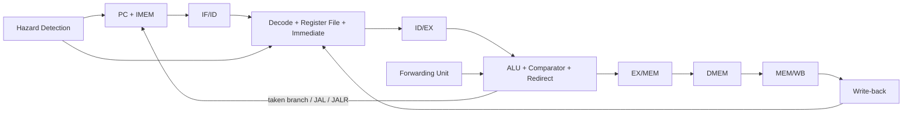

# RISCV32I — core RISC-V 32-bit pipeline 5 tầng

Tài liệu này là bản tổng hợp duy nhất của README và roadmap phát triển cho repo. Mục tiêu là cung cấp một điểm bắt đầu thống nhất cho người đọc, người kiểm thử và người phát triển muốn hiểu trạng thái hiện tại của core cũng như hướng đi tiếp theo.

## Tổng quan

Repo này triển khai một CPU RISC-V 32-bit theo kiến trúc pipeline 5 tầng, chủ yếu bằng Verilog-2001. Core hiện hỗ trợ datapath RV32I, xử lý hazard/forwarding, IMEM/DMEM nội bộ, testbench SystemVerilog không phụ thuộc UVM, cùng các cache L1 fully-associative độc lập.

Core hiện đã thực thi đúng các lệnh RV32I hợp lệ trong phạm vi memory model nội bộ. Các khía cạnh như exception, CSR, interrupt và trap architectural vẫn chưa được triển khai đầy đủ.

## Trạng thái hiện tại

| Thành phần | Trạng thái |
| --- | --- |
| Top-level core | `RISCV` |
| Kiến trúc | RV32I, pipeline 5 tầng, Harvard IMEM/DMEM |
| RTL | Verilog-2001 (`.v`) |
| Wrapper và testbench | SystemVerilog (`.sv`), không cần thư viện UVM |
| Reset | Active-low, `rstn_i` |
| Simulator đã kiểm chứng | Vivado XSim 2023.1 |
| Regression core | `82 PASS / 0 FAIL` |
| Directed class/mailbox test | `40 PASS / 0 FAIL` |
| Regression cache L1 | `23 PASS / 0 FAIL` |

Kết quả bên trên là kết quả XSim gần nhất của source hiện tại. Regression sẽ gọi `$fatal` nếu có mismatch, PC chứa `X/Z`, PC bị misaligned hoặc timeout.

## Kiến trúc tổng thể



Các tầng pipeline:

1. IF — Instruction Fetch
   - Chứa PC và IMEM.
   - Tăng PC thêm 4 trong luồng tuần tự.
   - Giữ IF/ID khi có load-use stall.
   - Redirect PC và flush IF/ID khi branch/jump được lấy.

2. ID — Instruction Decode
   - Decode opcode và control signal.
   - Đọc register file, tạo immediate và chốt thanh ghi ID/EX.
   - Có write-through WB→ID khi đọc và ghi cùng thanh ghi tại một cạnh clock.
   - Chèn bubble khi có load-use hazard hoặc control-flow flush.

3. EX — Execute
   - Thực hiện ALU, so sánh branch và tính target.
   - Tách riêng ALU operand B và store data.
   - Tạo `PC + 4` cho JAL/JALR, `PC + imm` cho AUIPC/JAL/branch và `(rs1 + imm) & ~1` cho JALR.

4. MEM — Memory Access
   - Thực hiện LB/LBU/LH/LHU/LW và SB/SH/SW.
   - DMEM đọc bất đồng bộ và ghi tại cạnh lên.
   - Chốt kết quả vào MEM/WB.

5. WB — Write Back
   - Chọn giữa kết quả ALU và dữ liệu load.
   - Ghi về register file; mọi ghi vào `x0` bị bỏ qua.

## Xử lý hazard

Core có các cơ chế sau:

- EX/MEM forwarding với độ ưu tiên cao nhất.
- MEM/WB forwarding khi không có match mới hơn từ EX/MEM.
- Forwarding độc lập cho operand A, operand B và store data.
- Một bubble cho load-use hazard với DMEM đọc bất đồng bộ hiện tại.
- WB→ID write-through cho trường hợp producer ghi WB đúng cạnh consumer đi vào ID/EX.
- Giữ đồng thời PC và IF/ID trong chu kỳ stall.
- Flush cả IF/ID và ID/EX khi taken branch, JAL hoặc JALR redirect tại EX.
- Không tạo false dependency với `rd = x0` hoặc instruction không sử dụng `rs1`/`rs2`.

## Tập lệnh được kiểm tra

| Nhóm | Lệnh | Trạng thái |
| --- | --- | --- |
| Register-register | `ADD SUB SLL SLT SLTU XOR SRL SRA OR AND` | Đã kiểm tra |
| Register-immediate | `ADDI SLTI SLTIU XORI ORI ANDI SLLI SRLI SRAI` | Đã kiểm tra |
| Upper immediate | `LUI AUIPC` | Đã kiểm tra |
| Load | `LB LH LW LBU LHU` | Đã kiểm tra với sign/zero extension |
| Store | `SB SH SW` | Đã kiểm tra byte-enable và store forwarding |
| Branch | `BEQ BNE BLT BGE BLTU BGEU` | Đã kiểm tra taken, not-taken và backward branch |
| Jump | `JAL JALR` | Đã kiểm tra link, redirect, flush và JALR bit 0 |
| Memory ordering | `FENCE` | Nhận diện; không có side effect trong memory model hiện tại |
| System | `ECALL EBREAK` | Nhận diện nhưng chưa phát trap |

Các encoding không hợp lệ không được phép ghi register hoặc memory, nhưng core chưa có illegal-instruction trap.

## Cấu trúc repository

```text
RISCV32I/
├── 00_src/
│   ├── Defines/
│   │   └── riscv_defines.v
│   ├── Fetch_stage/
│   │   ├── rtl/
│   │   │   ├── program_counter.v
│   │   │   ├── IMEM.v
│   │   │   └── IF_stage.v
│   │   └── IF_if.sv
│   ├── Decode_stage/
│   │   ├── rtl/
│   │   │   ├── control.v
│   │   │   ├── immediate_generator.v
│   │   │   ├── register_file.v
│   │   │   └── ID_stage.v
│   │   └── ID_if.sv
│   ├── Execute_stage/
│   │   ├── rtl/
│   │   │   ├── ALU.v
│   │   │   ├── ALU_control.v
│   │   │   ├── comparator.v
│   │   │   └── EXE_stage.v
│   │   └── EXE_if.sv
│   ├── Memory_stage/
│   │   ├── rtl/
│   │   │   ├── DMEM.v
│   │   │   └── MEM_stage.v
│   │   └── MEM_if.sv
│   ├── Top/
│   │   ├── rtl/
│   │   │   ├── forwarding.v
│   │   │   ├── hazard_detection.v
│   │   │   └── RISCV.v
│   │   └── CORE_if.sv
│   └── Cache/
│       ├── l1_icache_fa.v
│       ├── l1_dcache_fa.v
│       ├── cache_backing_memory.v
│       ├── cache_l1_tb.v
│       └── cache_filelist.f
├── 01_data_mem/
│   ├── IMEM.mem
│   └── DMEM.mem
├── 02_testlist/
│   └── các C++ harness theo stage đời đầu
├── 03_sim/
│   ├── Makefile
│   └── filelist/
└── 04_testbench/
    ├── c_compiler/
    │   ├── Makefile
    │   ├── example.c
    │   ├── startup.S
    │   ├── linker.ld
    │   ├── test/
    │   │   ├── 01_arithmetic_series.S
    │   │   ├── ...
    │   │   ├── 10_memory_copy_checksum.S
    │   │   └── README.md
    │   └── tools/
    │       ├── check_toolchain.ps1
    │       ├── bin_to_imem.ps1
    │       ├── build_riscv_toolchain.sh
    │       └── riscv-gnu-toolchain/  (source local, được ignore)
    ├── uvm/
    │   ├── RISCV32I_regression_tb.sv
    │   ├── RISCV32I_tb.sv
    │   └── RISCV32I_{Packet,Generator,Driver,Monitor,Scoreboard,Test}.sv
    ├── verilator/
    │   ├── top.sv
    │   ├── testbench_top.cpp
    │   └── filelist_tb.f
    └── vivado/
        └── RISCV_tb.sv
```

Các file `*_if.sv` là wrapper module cho từng stage; chúng không phải SystemVerilog `interface`.

## Top-level core

### Port

| Port | Hướng | Độ rộng | Mô tả |
| --- | --- | --- | --- |
| `clk_i` | Input | 1 bit | Clock cạnh lên |
| `rstn_i` | Input | 1 bit | Reset bất đồng bộ active-low |

### Parameter

| Parameter | Mặc định | Mô tả |
| --- | --- | --- |
| `IMEM_FILE` | `""` | File byte-hex dùng để khởi tạo IMEM |
| `DMEM_FILE` | `""` | File byte-hex dùng để khởi tạo DMEM |

Ví dụ tích hợp:

```verilog
RISCV #(
    .IMEM_FILE ("../01_data_mem/IMEM.mem"),
    .DMEM_FILE ("../01_data_mem/DMEM.mem")
) riscv_core_inst (
    .clk_i  (clock),
    .rstn_i (reset_n)
);
```

Đường dẫn `$readmemh` được resolve theo working directory của simulator, không theo vị trí file RTL.

## Định dạng bộ nhớ

### IMEM

- Dung lượng: 1024 byte.
- PC và địa chỉ IMEM là byte address.
- Mỗi instruction chiếm 4 byte và được lưu theo thứ tự MSB trước trong `IMEM.mem`.
- Ví dụ:

```text
00 50 02 93
```

Dòng trên tạo instruction `0x00500293`, tương ứng `addi x5, x0, 5`.

Nếu không cung cấp `IMEM_FILE`, toàn bộ IMEM được khởi tạo bằng NOP `0x00000013`.

### DMEM

- Phạm vi dữ liệu khởi tạo: 2049 byte, địa chỉ `0` đến `2048`.
- `DMEM.mem` chứa một byte hex cho mỗi địa chỉ liên tiếp.
- Dữ liệu word được tổ chức little-endian trong bốn bank byte.
- Byte access hợp lệ tại mọi byte address trong phạm vi.
- Halfword phải aligned 2 byte; word phải aligned 4 byte.
- Truy cập sai alignment hoặc ngoài phạm vi không làm thay đổi memory, nhưng chưa phát exception.

## Biên dịch C cho mô phỏng

Thư mục [`04_testbench/c_compiler`](04_testbench/c_compiler) cung cấp luồng bare-metal độc lập để biên dịch chương trình C bằng RISC-V GNU Toolchain. Cấu hình mặc định là `-march=rv32i -mabi=ilp32`, đúng với tập lệnh mà core hiện hỗ trợ. Luồng này không gọi Vivado.

Source chính thức `riscv-collab/riscv-gnu-toolchain` được clone cục bộ tại `04_testbench/c_compiler/tools/riscv-gnu-toolchain`, kèm ba submodule cần cho bare-metal là Binutils, GCC và Newlib. Source/build output được ignore khỏi repository chính. Sau khi build, Makefile tự nhận compiler tại `tools/riscv-gnu-toolchain/install/bin`; xem hướng dẫn compiler để phân biệt toolchain Linux/WSL và toolchain native Windows.

Nếu toolchain chưa nằm trong `PATH`, sao chép `toolchain.mk.example` thành `toolchain.mk`, rồi sửa `TOOLCHAIN_BIN` và `CROSS_COMPILE` theo bộ GCC đã cài. Ví dụ kiểm tra cấu hình và sinh assembly trên Windows:

```powershell
cd 04_testbench\c_compiler
Copy-Item toolchain.mk.example toolchain.mk
C:\MinGW\bin\mingw32-make.exe doctor
C:\MinGW\bin\mingw32-make.exe asm
```

Target `asm` tạo `build/example.s`. Target `program` tạo thêm ELF, map, disassembly, binary và `build/example_IMEM.mem`:

```powershell
C:\MinGW\bin\mingw32-make.exe program
```

Bộ 10 thuật toán assembly RV32I standalone nằm trong
[`04_testbench/c_compiler/test`](04_testbench/c_compiler/test). Có thể build
một test hoặc toàn bộ test bằng:

```powershell
C:\MinGW\bin\mingw32-make.exe test TEST_NAME=01_arithmetic_series
C:\MinGW\bin\mingw32-make.exe test-all
```

Mỗi thuật toán ghi trạng thái PASS/FAIL và cặp actual/expected vào DMEM, đồng
thời tạo ELF, disassembly và `IMEM.mem` riêng trong `build/test`.

Bộ chuyển đổi IMEM đảo thứ tự từng nhóm 4 byte từ binary little-endian của GNU `objcopy` sang dạng MSB-trước mà module `IMEM.v` đang đọc. Target `deploy-imem` mới ghi đè `01_data_mem/IMEM.mem`; các target mặc định không thay đổi file memory của repository. Không đặt `ARCH=rv32im` cho đến khi extension M đã được tích hợp hoàn chỉnh vào datapath. Xem [hướng dẫn compiler](04_testbench/c_compiler/README.md) để biết cách dùng file C khác và các giới hạn bare-metal.

## Cache L1

Thư mục `00_src/Cache` chứa hai cache blocking fully-associative viết bằng Verilog-2001:

- `l1_icache_fa.v`: read-only, read-allocate, hỗ trợ invalidate.
- `l1_dcache_fa.v`: write-back, write-allocate, byte strobe và flush dirty line.
- Replacement: chọn line invalid trước, sau đó round-robin xác định.
- Cấu hình mặc định: 4 line, 4 word 32-bit mỗi line.
- Giao tiếp CPU và backing memory dùng valid/ready; chỉ có một request outstanding.

Cache hiện là khối độc lập và chưa nối trực tiếp vào pipeline. IF/MEM của core chưa có handshake chờ cache miss. Khi tích hợp phải stall PC và các pipeline register liên quan cho tới khi cache trả `cpu_response_valid_o`.

## Môi trường kiểm chứng

| Top testbench | Mục đích |
| --- | --- |
| `RISCV32I_regression_tb` | Regression self-checking chính, không dùng class/UVM |
| `RISCV32I_tb` | Môi trường class/mailbox theo cấu trúc UVM cơ bản nhưng không cần thư viện UVM |
| `RISCV_tb` | Nạp `IMEM.mem`, disassemble instruction và hiển thị assembly trên console/waveform |
| `cache_l1_tb` | Regression self-checking cho I-cache và D-cache |

### Chạy regression với Vivado XSim

```text
cd 03_sim
xvlog --sv -f ../04_testbench/filelist_tb.f
xelab work.RISCV32I_regression_tb -s rv32i_regression_sim --debug typical --timescale 1ns/1ps
xsim rv32i_regression_sim -runall
```

Kết quả mong đợi:

```text
RV32I REGRESSION SUMMARY: PASS=82 FAIL=0 TOTAL=82
INSTRUCTION_CASES=40 SEQUENCE_CASES=10
```

### Chạy class/mailbox testbench

```text
xelab work.RISCV32I_tb -s rv32i_class_sim --debug typical --timescale 1ns/1ps
xsim rv32i_class_sim -runall
```

### Chạy waveform/disassembly

```text
xvlog --sv -f ../04_testbench/filelist_tb.f ../04_testbench/RISCV_tb.sv
xelab work.RISCV_tb -s rv32i_wave_sim --debug typical --timescale 1ns/1ps
xsim rv32i_wave_sim --gui -testplusarg IMEM_FILE=../01_data_mem/IMEM.mem -testplusarg IMEM_WORDS=53
```

### Chạy cache regression

```text
cd 00_src/Cache
xvlog -f cache_filelist.f
xelab work.cache_l1_tb -s cache_l1_sim --debug typical --timescale 1ns/1ps
xsim cache_l1_sim -runall
```

### Verilator

```text
cd 03_sim
make TOP_MODULE
# hoặc
make all
```

## Roadmap phát triển

Tài liệu này giữ lại roadmap dưới dạng các mốc phát triển rõ ràng.

| Mốc | Hạng mục | Trạng thái |
| --- | --- | --- |
| 0 | RV32I pipeline 5 tầng | `[x]` |
| 1 | RV32M — nhân/chia số nguyên | `[~]` |
| 2 | Trap chính xác, Machine mode cơ bản và Zicsr | `[ ]` |
| 3 | Zifencei | `[ ]` |
| 4 | Zba, Zbb và Zbs — bit manipulation | `[ ]` |
| 5 | RV32C — compressed instruction | `[ ]` |
| 6 | RV32A — atomic instruction | `[ ]` |
| 7 | RV32F, sau đó RV32D — floating point | `[ ]` |
| 8 | RV32V — vector | `[ ]` |

### Quy tắc chung khi thêm extension

- Tách decode và datapath khỏi RV32I cơ bản.
- Mỗi extension có tham số bật/tắt ở top-level.
- Khi tắt, encoding của extension phải được xem là illegal và hành vi RV32I không thay đổi.
- Decode phải kiểm tra đầy đủ `opcode`, `funct3` và `funct7`.
- Mọi mốc phải chạy lại regression RV32I và regression của các extension đã hoàn thành trước đó.

### Mốc 1 — RV32M

RV32M bổ sung tám lệnh `MUL`, `MULH`, `MULHSU`, `MULHU`, `DIV`, `DIVU`, `REM`, `REMU`.

Tiêu chí hoàn thành bao gồm:

- Cả tám instruction pass directed test và unit test.
- Core regression pass `28/28` và RV32I regression vẫn pass `82/82`.
- Vivado XSim compile/simulate không lỗi.

### Mốc 2 — Trap, Machine mode và Zicsr

Phạm vi ban đầu gồm CSR tối thiểu, trap cho illegal instruction, `ECALL`, `EBREAK`, misaligned access, `MRET` và interrupt timer/external tối thiểu.

### Mốc 3–8

- 3: `FENCE.I` và đồng bộ fetch.
- 4: Zba/Zbb/Zbs bit manipulation.
- 5: RV32C compressed instruction.
- 6: RV32A atomic instruction.
- 7: RV32F và RV32D floating-point.
- 8: RV32V vector.

### Hạ tầng và kiểm chứng song song

Các hạng mục dưới đây không phụ thuộc vào một extension cụ thể và được thực hiện dần trong suốt roadmap:

1. Bổ sung memory ready/valid và cơ chế global pipeline stall.
2. Tích hợp I-cache/D-cache vào IF và MEM.
3. Thay memory model nội bộ bằng BRAM hoặc external memory bus.
4. Bổ sung instruction-retirement interface để so sánh với reference model.
5. Chạy RISC-V architectural compliance tests và bổ sung formal assertions.

## Giới hạn hiện tại

- Chưa có CSR, privilege mode, interrupt hoặc exception controller.
- `ECALL`, `EBREAK` và illegal instruction chưa chuyển PC tới trap vector.
- Misaligned load/store bị chặn nhưng chưa tạo exception.
- Chưa có instruction-address-misaligned trap.
- Không hỗ trợ extension M, A, F, D, C hoặc các extension khác ngoài datapath RV32I.
- IMEM/DMEM đang là memory model nội bộ; top chưa có bus AXI/AHB/Wishbone.
- Cache L1 chưa tích hợp vào core vì pipeline chưa có ready/valid stall handshake cho cache miss.
- Repo hiện không kèm Vivado `.xpr`; có thể dùng XSim CLI như trên hoặc tự tạo project và thêm source/filelist.
