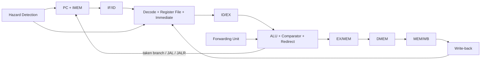

# RISCV32I — bộ xử lý RISC-V 32-bit pipeline 5 tầng

Đây là một thiết kế CPU RISC-V 32-bit theo kiến trúc pipeline 5 tầng, được viết chủ yếu bằng Verilog-2001. Repo bao gồm datapath RV32I, xử lý hazard/forwarding, bộ nhớ lệnh và dữ liệu nội bộ, môi trường kiểm chứng SystemVerilog không phụ thuộc thư viện UVM, cùng các cache L1 fully-associative độc lập.

Thiết kế hiện thực thi đúng các lệnh RV32I hợp lệ với địa chỉ aligned trong phạm vi bộ nhớ nội bộ. Exception, CSR, interrupt và trap architectural chưa được triển khai; xem phần [Giới hạn hiện tại](#giới-hạn-hiện-tại).

## Trạng thái hiện tại

| Thành phần | Trạng thái |
| --- | --- |
| Top-level core | `RISCV` |
| Kiến trúc | RV32I, pipeline 5 tầng, Harvard IMEM/DMEM |
| RTL | Verilog-2001 (`.v`) |
| Wrapper và testbench | SystemVerilog (`.sv`), không cần thư viện UVM |
| Reset | Active-low, `rstn_i` |
| Simulator đã kiểm chứng | Vivado XSim 2023.1 |
| Regression core | `82 PASS / 0 FAIL` |
| Directed class/mailbox test | `40 PASS / 0 FAIL` |
| Regression cache L1 | `23 PASS / 0 FAIL` |

Kết quả trên là kết quả XSim gần nhất của source hiện tại. Regression sẽ gọi `$fatal` nếu có mismatch, PC chứa `X/Z`, PC bị misaligned hoặc timeout.

## Kiến trúc tổng thể



Các tầng pipeline:

1. **IF — Instruction Fetch**
   - Chứa program counter và IMEM.
   - Tăng PC thêm 4 trong luồng tuần tự.
   - Giữ IF/ID khi có load-use stall.
   - Redirect PC và flush IF/ID khi branch/jump được lấy.

2. **ID — Instruction Decode**
   - Decode opcode và control signal.
   - Đọc register file, tạo immediate và chốt thanh ghi ID/EX.
   - Có write-through WB→ID khi đọc và ghi cùng thanh ghi tại một cạnh clock.
   - Chèn bubble khi có load-use hazard hoặc control-flow flush.

3. **EX — Execute**
   - Thực hiện ALU, so sánh branch và tính target.
   - Tách riêng ALU operand B và store data.
   - Tạo `PC + 4` cho JAL/JALR, `PC + imm` cho AUIPC/JAL/branch và `(rs1 + imm) & ~1` cho JALR.

4. **MEM — Memory Access**
   - Thực hiện LB/LBU/LH/LHU/LW và SB/SH/SW.
   - DMEM đọc bất đồng bộ và ghi tại cạnh lên.
   - Chốt kết quả vào MEM/WB.

5. **WB — Write Back**
   - Chọn giữa kết quả ALU và dữ liệu load.
   - Ghi về register file; mọi ghi vào `x0` bị bỏ qua.

## Xử lý hazard

Core có các cơ chế sau:

- EX/MEM forwarding với độ ưu tiên cao nhất.
- MEM/WB forwarding khi không có match mới hơn từ EX/MEM.
- Forwarding độc lập cho operand A, operand B và store data.
- Một bubble cho load-use hazard với DMEM đọc bất đồng bộ hiện tại.
- WB→ID write-through cho trường hợp producer ghi WB đúng cạnh consumer đi vào ID/EX.
- Giữ đồng thời PC và IF/ID trong chu kỳ stall.
- Flush cả IF/ID và ID/EX khi taken branch, JAL hoặc JALR redirect tại EX.
- Không tạo false dependency với `rd = x0` hoặc trường instruction không sử dụng `rs1`/`rs2`.

## Tập lệnh được kiểm tra

| Nhóm | Lệnh | Trạng thái |
| --- | --- | --- |
| Register-register | `ADD SUB SLL SLT SLTU XOR SRL SRA OR AND` | Đã kiểm tra |
| Register-immediate | `ADDI SLTI SLTIU XORI ORI ANDI SLLI SRLI SRAI` | Đã kiểm tra |
| Upper immediate | `LUI AUIPC` | Đã kiểm tra |
| Load | `LB LH LW LBU LHU` | Đã kiểm tra với sign/zero extension |
| Store | `SB SH SW` | Đã kiểm tra byte-enable và store forwarding |
| Branch | `BEQ BNE BLT BGE BLTU BGEU` | Đã kiểm tra taken, not-taken và backward branch |
| Jump | `JAL JALR` | Đã kiểm tra link, redirect, flush và JALR bit 0 |
| Memory ordering | `FENCE` | Nhận diện; không có side effect trong memory model hiện tại |
| System | `ECALL EBREAK` | Nhận diện nhưng chưa phát trap |

Các encoding không hợp lệ không được phép ghi register hoặc memory, nhưng core chưa có illegal-instruction trap.

## Cấu trúc repository

Cây dưới đây liệt kê các thư mục và tệp chính:

```text
RISCV32I/
├── 00_src/
│   ├── Defines/
│   │   └── riscv_defines.v
│   ├── Fetch_stage/
│   │   ├── rtl/
│   │   │   ├── program_counter.v
│   │   │   ├── IMEM.v
│   │   │   └── IF_stage.v
│   │   └── IF_if.sv
│   ├── Decode_stage/
│   │   ├── rtl/
│   │   │   ├── control.v
│   │   │   ├── immediate_generator.v
│   │   │   ├── register_file.v
│   │   │   └── ID_stage.v
│   │   └── ID_if.sv
│   ├── Execute_stage/
│   │   ├── rtl/
│   │   │   ├── ALU.v
│   │   │   ├── ALU_control.v
│   │   │   ├── comparator.v
│   │   │   └── EXE_stage.v
│   │   └── EXE_if.sv
│   ├── Memory_stage/
│   │   ├── rtl/
│   │   │   ├── DMEM.v
│   │   │   └── MEM_stage.v
│   │   └── MEM_if.sv
│   ├── Top/
│   │   ├── rtl/
│   │   │   ├── forwarding.v
│   │   │   ├── hazard_detection.v
│   │   │   └── RISCV.v
│   │   └── CORE_if.sv
│   └── Cache/
│       ├── l1_icache_fa.v
│       ├── l1_dcache_fa.v
│       ├── cache_backing_memory.v
│       ├── cache_l1_tb.v
│       └── cache_filelist.f
├── 01_data_mem/
│   ├── IMEM.mem
│   └── DMEM.mem
├── 02_testlist/
│   └── các C++ harness theo stage đời đầu
├── 03_sim/
│   ├── Makefile
│   └── filelist/
└── 04_testbench/
    ├── RISCV32I_regression_tb.sv
    ├── RISCV32I_tb.sv
    ├── RISCV32I_{Packet,Generator,Driver,Monitor,Scoreboard,Test}.sv
    ├── RISCV32I_io.sv
    ├── RISCV_tb.sv
    ├── RISCV32I_verilator_top.sv
    ├── testbench_top.cpp
    └── filelist_tb.f
```

Các file `*_if.sv` là wrapper module cho từng stage; chúng không phải SystemVerilog `interface`.

## Top-level core

### Port

| Port | Hướng | Độ rộng | Mô tả |
| --- | --- | --- | --- |
| `clk_i` | Input | 1 bit | Clock cạnh lên |
| `rstn_i` | Input | 1 bit | Reset bất đồng bộ active-low |

### Parameter

| Parameter | Mặc định | Mô tả |
| --- | --- | --- |
| `IMEM_FILE` | `""` | File byte-hex dùng để khởi tạo IMEM |
| `DMEM_FILE` | `""` | File byte-hex dùng để khởi tạo DMEM |

Ví dụ tích hợp:

```verilog
RISCV #(
    .IMEM_FILE ("../01_data_mem/IMEM.mem"),
    .DMEM_FILE ("../01_data_mem/DMEM.mem")
) riscv_core_inst (
    .clk_i  (clock),
    .rstn_i (reset_n)
);
```

Đường dẫn `$readmemh` được resolve theo working directory của simulator, không theo vị trí file RTL.

## Định dạng bộ nhớ

### IMEM

- Dung lượng: 1024 byte.
- PC và địa chỉ IMEM là byte address.
- Mỗi instruction chiếm 4 byte và được lưu theo thứ tự MSB trước trong `IMEM.mem`.
- Ví dụ:

```text
00 50 02 93
```

Dòng trên tạo instruction `0x00500293`, tương ứng `addi x5, x0, 5`.

Nếu không cung cấp `IMEM_FILE`, toàn bộ IMEM được khởi tạo bằng NOP `0x00000013`.

### DMEM

- Phạm vi dữ liệu khởi tạo: 2049 byte, địa chỉ `0` đến `2048`.
- `DMEM.mem` chứa một byte hex cho mỗi địa chỉ liên tiếp.
- Dữ liệu word được tổ chức little-endian trong bốn bank byte.
- Byte access hợp lệ tại mọi byte address trong phạm vi.
- Halfword phải aligned 2 byte; word phải aligned 4 byte.
- Truy cập sai alignment hoặc ngoài phạm vi không làm thay đổi memory, nhưng chưa phát exception.

## Cache L1

Thư mục `00_src/Cache` chứa hai cache blocking fully-associative viết bằng Verilog-2001:

- `l1_icache_fa.v`: read-only, read-allocate, hỗ trợ invalidate.
- `l1_dcache_fa.v`: write-back, write-allocate, byte strobe và flush dirty line.
- Replacement: chọn line invalid trước, sau đó round-robin xác định.
- Cấu hình mặc định: 4 line, 4 word 32-bit mỗi line.
- Giao tiếp CPU và backing memory dùng valid/ready; chỉ có một request outstanding.

Cache hiện là khối độc lập và **chưa nối trực tiếp vào pipeline**. IF/MEM của core chưa có handshake chờ cache miss. Khi tích hợp phải stall PC và các pipeline register liên quan cho tới khi cache trả `cpu_response_valid_o`.

Xem thêm tại [`00_src/Cache/README.md`](00_src/Cache/README.md).

## Môi trường kiểm chứng

| Top testbench | Mục đích |
| --- | --- |
| `RISCV32I_regression_tb` | Regression self-checking chính, không dùng class/UVM |
| `RISCV32I_tb` | Môi trường class/mailbox theo cấu trúc UVM cơ bản nhưng không cần thư viện UVM |
| `RISCV_tb` | Nạp `IMEM.mem`, disassemble instruction và hiển thị assembly trên console/waveform |
| `cache_l1_tb` | Regression self-checking cho I-cache và D-cache |

Regression chính bao phủ:

- 40 directed instruction cases.
- Cả taken và not-taken cho 6 branch.
- Backward branch và sign-extended branch immediate.
- EX/MEM và MEM/WB forwarding trên cả operand A/B.
- Store-data forwarding.
- Load-use stall.
- WB→ID same-edge bypass.
- Bảo vệ `x0` và loại `x0` khỏi forwarding dependency.
- JAL/JALR link, redirect và wrong-path flush.
- Taken branch phụ thuộc dữ liệu và loại bỏ wrong-path register/memory side effect.
- Kiểm tra PC không chứa `X/Z` và luôn aligned sau reset.

Các con số PASS ở đây là directed functional checks, không phải phần trăm code/functional coverage; repo hiện chưa có `covergroup` hoặc báo cáo coverage tự động.

## Chạy regression với Vivado XSim

Vivado 2023.1 đã được dùng để kiểm chứng các lệnh dưới đây. Chạy từ thư mục `03_sim` trong Vivado Command Prompt hoặc shell đã thêm thư mục `Vivado/bin` vào `PATH`.

### Regression chính

```text
cd 03_sim
xvlog --sv -f ../04_testbench/filelist_tb.f
xelab work.RISCV32I_regression_tb -s rv32i_regression_sim --debug typical --timescale 1ns/1ps
xsim rv32i_regression_sim -runall
```

Kết quả mong đợi:

```text
RV32I REGRESSION SUMMARY: PASS=82 FAIL=0 TOTAL=82
INSTRUCTION_CASES=40 SEQUENCE_CASES=10
```

### Class/mailbox testbench

Sau bước `xvlog` phía trên:

```text
xelab work.RISCV32I_tb -s rv32i_class_sim --debug typical --timescale 1ns/1ps
xsim rv32i_class_sim -runall
```

Kết quả mong đợi:

```text
RV32I SUMMARY: PASS=40 FAIL=0 TOTAL=40
```

Testbench này dùng class, mailbox, generator, driver, monitor và scoreboard thuần SystemVerilog. Không cần cài thư viện UVM.

### Disassembly và assembly trên waveform

```text
xvlog --sv -f ../04_testbench/filelist_tb.f ../04_testbench/RISCV_tb.sv
xelab work.RISCV_tb -s rv32i_wave_sim --debug typical --timescale 1ns/1ps
xsim rv32i_wave_sim --gui -testplusarg IMEM_FILE=../01_data_mem/IMEM.mem -testplusarg IMEM_WORDS=53
```

Các signal nên thêm vào Wave:

- `trace_pc`
- `trace_instruction`
- `instruction_decode_ascii`
- `instruction_decode_string`

Đặt radix của `instruction_decode_ascii` thành **ASCII** trong Vivado Wave. Packed ASCII signal được dùng vì XSim không hỗ trợ ổn định việc đưa dynamic `string` trực tiếp lên waveform.

Có thể override file và số instruction bằng test plusarg:

```text
xsim rv32i_wave_sim -runall -testplusarg IMEM_FILE=../01_data_mem/IMEM.mem -testplusarg IMEM_WORDS=53
```

Dùng `-testplusarg NO_FETCH_TRACE` nếu chỉ muốn waveform và không muốn in từng fetch ra console.

## Chạy cache regression

Từ thư mục `00_src/Cache`:

```text
xvlog -f cache_filelist.f
xelab work.cache_l1_tb -s cache_l1_sim --debug typical --timescale 1ns/1ps
xsim cache_l1_sim -runall
```

Kết quả mong đợi:

```text
CACHE TEST SUMMARY: PASS=23 FAIL=0 TOTAL=23
```

## Verilator

Flow Verilator dùng `RISCV32I_verilator_top.sv`, `testbench_top.cpp` và `03_sim/Makefile`. Cần Verilator, GNU Make, trình biên dịch C++ và một shell tương thích lệnh Unix như Linux, WSL hoặc MSYS2.

```text
cd 03_sim
make TOP_MODULE
```

Hoặc chạy flow mặc định:

```text
make all
```

Simulation tạo `wave.fst`. Có thể mở bằng GTKWave:

```text
gtkwave wave.fst
```

C++ harness hiện là smoke test tạo waveform, không phải functional scoreboard. Dùng XSim regression để xác nhận tính đúng của instruction và pipeline. Flow Verilator là tùy chọn và chưa được chạy lại trên môi trường hiện tại. Các target Verilator theo từng stage cùng source trong `02_testlist` được giữ như hạ tầng đời đầu và không nằm trong regression đã xác nhận.

## Quy ước code

- RTL synthesizable dùng `.v` và cú pháp Verilog-2001.
- Testbench/wrapper dùng `.sv` khi cần class, mailbox, string hoặc logic kiểu SystemVerilog.
- Mỗi port input/output được khai báo trên một dòng riêng.
- Hậu tố tên signal:
  - `_i`: input.
  - `_o`: output.
  - `_w`: wire/combinational signal.
  - `_r`: register nội bộ.
  - `_q`: state/register lưu trữ.
- `rstn_i` luôn là reset active-low.
- `x0` luôn đọc bằng 0 và không nhận write-back.

## Giới hạn hiện tại

- Chưa có CSR, privilege mode, interrupt hoặc exception controller.
- `ECALL`, `EBREAK` và illegal instruction chưa chuyển PC tới trap vector.
- Misaligned load/store bị chặn nhưng chưa tạo exception.
- Chưa có instruction-address-misaligned trap.
- Không hỗ trợ extension M, A, F, D, C hoặc các extension khác ngoài datapath RV32I nêu trên.
- `riscv_defines.v` có một số macro encoding dành cho CSR, privilege và extension khác; các macro này không đồng nghĩa với việc datapath đã hỗ trợ các lệnh đó.
- IMEM/DMEM đang là memory model nội bộ; top chưa có bus AXI/AHB/Wishbone.
- DMEM hiện đọc bất đồng bộ. Nếu thay bằng block RAM đồng bộ phải điều chỉnh latency và hazard/stall.
- Cache L1 chưa tích hợp vào core vì pipeline chưa có ready/valid stall handshake cho cache miss.
- Repo hiện không kèm Vivado `.xpr`; có thể dùng XSim CLI như trên hoặc tự tạo project và thêm source/filelist.

## Hướng phát triển đề xuất

1. Thêm exception/trap path, CSR và `mtvec/mepc/mcause`.
2. Thêm memory ready/valid và global pipeline stall.
3. Tích hợp I-cache/D-cache vào IF và MEM.
4. Thay memory model bằng BRAM hoặc external memory bus.
5. Thêm instruction retirement interface để so sánh với reference model.
6. Chạy RISC-V architectural compliance tests và formal assertions.
